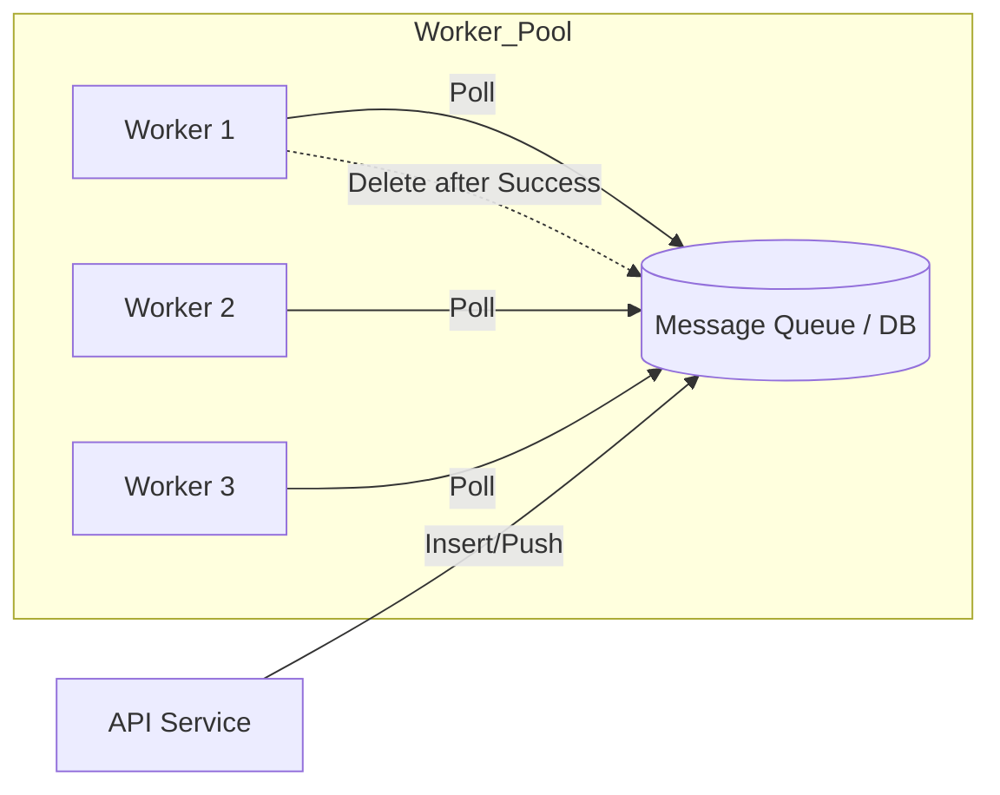
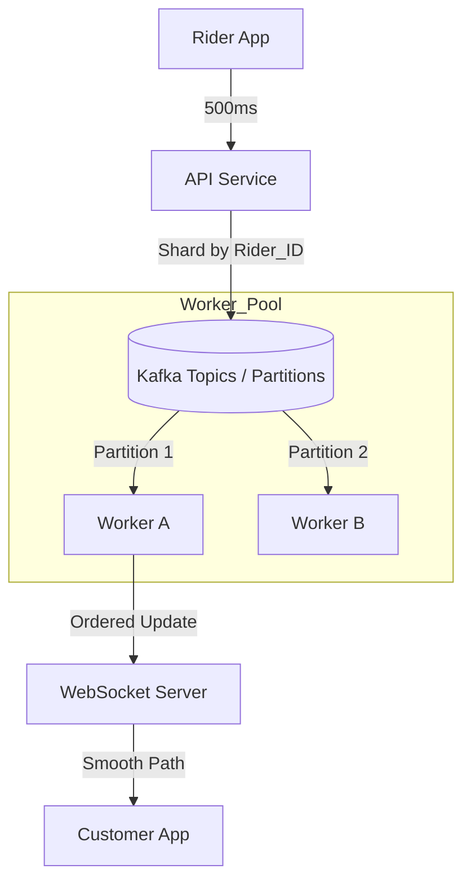
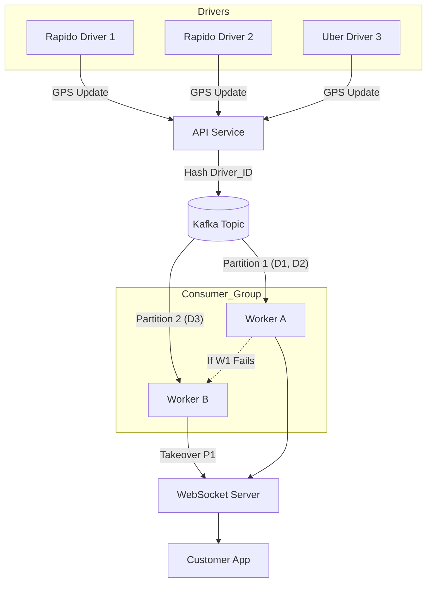

# Pull-Based Architecture: The Power of Independent Workers

## Introduction: The "Take What You Can" Approach

In a **Pull-Based Architecture**, the workers are in control. Instead of a central manager pushing tasks to them, workers proactively ask (poll) a central message broker or database for new work. 

This model is exceptionally robust for handling variable workloads and preventing workers from being overwhelmed.

---

## Data Flow: The Pull Model

In this design, the API server simply drops a "Task" into a queue or database and forgets about it. The workers then "Pull" the task when they are ready.



---

## Core Mechanism: The "Lease" Pattern (Visibility Timeout)

Because multiple workers are pulling from the same source, we need a way to ensure the same task isn't performed twice. This is solved using a **Lease** or **Visibility Timeout**.

1.  **Pick it up:** A worker polls the queue and finds a task.
2.  **Mark for Deletion (In-Flight):** The task is marked as "In Progress." It becomes invisible to other workers for a set `Time Interval` (e.g., 10 minutes).
3.  **Perform:** The worker executes the task.
4.  **Finally Delete:** Upon success, the worker explicitly deletes the message from the queue.

### What if the worker fails?
If the worker crashes mid-task, the `Time Interval` expires. The task becomes visible again, and another worker can pick it up. This ensures **At-Least-Once Delivery**.

### The Worker Logic (Pseudo-code)

The worker follows a strict loop to ensure tasks are processed reliably:

```javascript
while (true) {
    if (there_is_task) {
        // 1. Pick it up from the DB/Queue
        // 2. Mark for deletion + set Visibility Timeout (Lease)
        //    (e.g., mark for 10 min)
        perform_task();
        
        // 3. Finally delete the message from the queue
        delete_from_queue();
    }
}
```

### AWS SQS Implementation Detail
For a Simple Queue Service, the logic specifically handles the "Dead Letter" flow:

```pseudo
Read from SQS
Set TTL (Time To Live)
Try:
    performTask()
    if (Success):
        deleteMessageFromQueue()
Exception:
    if (RetryCount > Max):
        pushToDLQ(failed_msg_db)
```

---

## Real-World Examples

| System | Role in Pull Architecture |
| :--- | :--- |
| **AWS SQS** | A simple, highly scalable queue system. Uses visibility timeouts. |
| **Kafka** | A distributed streaming platform. Consumers (pullers) maintain their own "offset" (position) in the log. |
| **BullMQ** | A Redis-based queue for Node.js. Optimized for fast job polling. |

---

## The Starvation Problem

A common mistake in pull-based systems is pushing a failed message back to the same database/queue immediately. 
*   **The Issue:** If a task keeps failing, it stays at the top of the queue, "starving" newer, successful tasks from being processed.
*   **The Fix:** Always offload failed messages to a **Dead Letter Queue (DLQ)** after $X$ retries.

---

## Case Study: Real-Time Updates (Uber-like System)

A common use case for pull-based brokers is tracking a Rider's location in real-time.

### The Requirement
*   **Source:** A Rider app sends its GPS coordinates every **500ms**.
*   **Destination:** The Customer app needs to see the Rider moving smoothly on a map.

### The Problem: Out-of-Order Delivery
In a standard pull-based queue (like a simple DB or basic SQS), multiple workers pull messages simultaneously.
1.  **Race Condition:** Worker A pulls the "Location at 2s" message. Worker B pulls the "Location at 4s" message.
2.  **Processing Latency:** If Worker B is faster, the "Location at 4s" might be published to the Customer **before** "Location at 2s".
3.  **Result:** The customer's map UI "jumps" backward and forward, creating a terrible experience.

### The Solution: Kafka (Pull Based with Partitions)
We use a sophisticated pull-based broker like **Kafka** to maintain order and scale.



*   **Partitioning:** We hash the `Driver_ID` so that **all updates from the same driver** always go to the **same Partition**.
*   **Consumer Group:** Kafka ensures that only **one worker** is assigned to pull from that specific partition at any given time.
*   **Sequential Processing:** The worker pulls message #1, processes it, then pulls message #2. Order is strictly preserved for each driver.

#### Scenario 1: What if a Worker (Consumer) Fails?
If `Worker A` (responsible for `Partition 1`) crashes:
1.  **Detection:** Kafka's Group Coordinator stops receiving heartbeats from `Worker A`.
2.  **Rebalancing:** Kafka triggers a rebalance and assigns `Partition 1` to `Worker B`.
3.  **Resume:** `Worker B` reads the **Last Committed Offset** for `Partition 1` and resumes processing. 
4.  **Result:** No location updates are lost, and the sequence for those drivers remains intact.

#### Scenario 2: What if we have Multiple Consumers?
To handle high traffic (e.g., peak hours with many Rapido drivers):
1.  **Horizontal Scaling:** We add more workers to the **same Consumer Group**.
2.  **Distribution:** Kafka automatically spreads the 100+ partitions across the 10-20 available workers.
3.  **Efficiency:** Each worker handles a subset of drivers independently, maximizing throughput without race conditions.

#### Scenario 3: Handling Millions of Drivers
To support millions of drivers (like Uber/Rapido globally):
1.  **High Partition Count:** We create topics with hundreds or thousands of partitions.
2.  **Stateless API:** The API server doesn't care which worker is processing which driver; it just hashes the `Driver_ID` and pushes to Kafka.
3.  **Independent Workers:** Each worker "Pulls" only its assigned partitions, keeping the system decentralized and highly available.

#### Complete Fault-Tolerant Architecture:


---

## Summary: Pros and Cons

| Pros | Cons |
| :--- | :--- |
| **No Overwhelming:** Workers only take what they can handle. | **Latency:** Small delay caused by polling intervals. |
| **Automatic Scaling:** Just add more workers; no manager config needed. | **Starvation:** Low-priority tasks might wait forever if the queue is full. |
| **Fault Tolerance:** If a worker dies, the task just times out and returns. | **Complexity:** Handling "In-Flight" logic and DLQs. |
