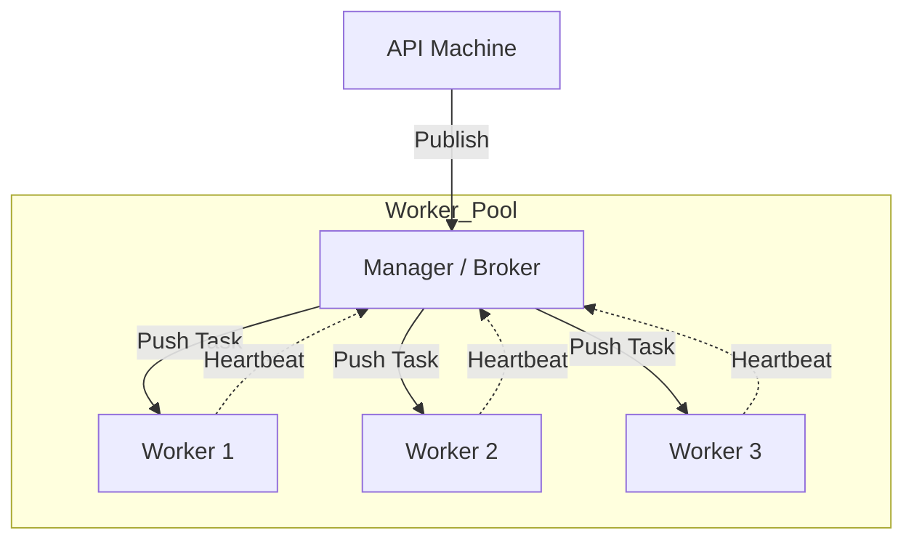

# Push-Based Architecture: The Power of the Manager

## Introduction: The "Boss Knows Best" Approach

In a **Push-Based Architecture**, also known as **Publish-Subscribe (Pub/Sub)**, a central component—the **Manager** or **Message Broker**—actively pushes tasks to available workers. 

This model is ideal for real-time systems where low latency is critical and the central manager can strategically decide which worker is best suited for a specific task.

---

## Data Flow: The Push Model

The API sends a message to the "Manager," which then "Shouts" (pushes) it to the workers.



---

## Core Mechanism: Health Monitoring and Heartbeats

Unlike the pull model (where workers pick their own tasks), the manager needs to know if a worker is alive. This is done via **Heartbeats**.

1.  **State Updates:** Every 10 seconds, each worker updates its state to the Manager.
2.  **Health Check:** If the Manager hasn't heard from a worker for more than 20 seconds, it marks the worker as "Dead."
3.  **Redistribution:** If a worker dies while processing, the Manager updates the database and assigns the task to a new worker (incrementing the retry count).

### The Manager Strategy (The "Shout")

The Manager doesn't just send messages; it orchestrates the entire flow:

```pseudo
while (true) {
    // Throttling: Prevents overwhelming the system
    if (processed_this_sec < 5) { 
        if (msg_in_db) {
            worker = choose_random_worker();
            send_to_worker(worker, msg);
            
            // Mark as 'In Progress' in DB
            update_db(worker_id, status="processing"); 
        }
    }
}
```

### Worker Health: The Heartbeat Logic

To ensure the Manager isn't pushing tasks to "ghost" workers, a heartbeat system is required:

*   **Worker side:** Every 10 seconds, the worker sends a "still alive" signal to the Manager.
*   **Manager side:** 
    ```pseudo
    if (CurrentTime - LastHeartbeat > 20s) {
        mark_worker_as_dead();
        // Return tasks to queue/assign to new worker
        reschedule_tasks(worker_id);
        increase_retry_count();
    }
    ```

---

## Real-World Example: Email Servers & Pub/Sub

Push-based systems are often used for massive "Shout" operations like sending emails to millions of users.

*   **Pub/Sub:** The "Manager" publishes the email content to a "Shout" channel.
*   **Acquiring Locks:** To prevent duplicate emails, workers must:
    1.  Receive the "Shout."
    2.  Try to **Acquire a Distributed Lock** (e.g., in Redis) for that specific Email ID.
    3.  Only the worker with the lock proceeds; others ignore the message.

---

## Scaling and Reliability

### 1. The Manager is Down
If the Manager crashes, the entire system stops. However, because the Manager is **Stateless** (it just forwards messages), we can scale it horizontally behind a Load Balancer.

### 2. The Worker is Down
If a worker crashes mid-task, the Manager will detect the missing heartbeat (after 20s) and automatically re-assign the task to a new worker.

---

## Summary: Pros and Cons

| Pros | Cons |
| :--- | :--- |
| **Low Latency:** Messages are delivered the instant they are available. | **Overwhelming:** If the manager pushes too fast, workers can crash (Solved by **Throttling**). |
| **Centralized Control:** The Manager can implement complex routing (e.g., "Send to the least busy worker"). | **Single Point of Failure:** If the Manager goes down, the whole system stalls (Solved by **Stateless Scaling**). |
| **Real-Time:** Perfect for instant notifications and chat apps. | **Complexity:** Requires robust "Heartbeat" and "Acknowledgment" logic. |

---

## Comparison: Push vs. Pull

| Feature | Pull (e.g., SQS, Kafka) | Push (e.g., RabbitMQ, PubSub) |
| :--- | :--- | :--- |
| **Control** | Workers are in control | Manager is in control |
| **Best For** | Heavy, uneven workloads | Real-time, low-latency tasks |
| **Failure Mode** | Task times out and returns | Manager must detect dead worker |
| **Complexity** | High (DLQs, visibility) | High (Heartbeats, acknowledgments) |

## Conclusion

Neither model is "best"—it all depends on your use case. If you need absolute reliability and don't care about a few seconds of lag, **Pull** is your friend. If you need sub-second delivery and have a predictable load, **Push** is the way to go.
