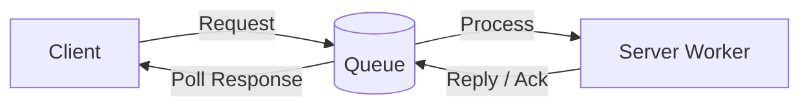
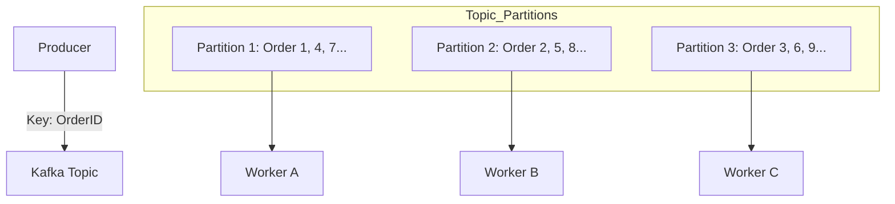
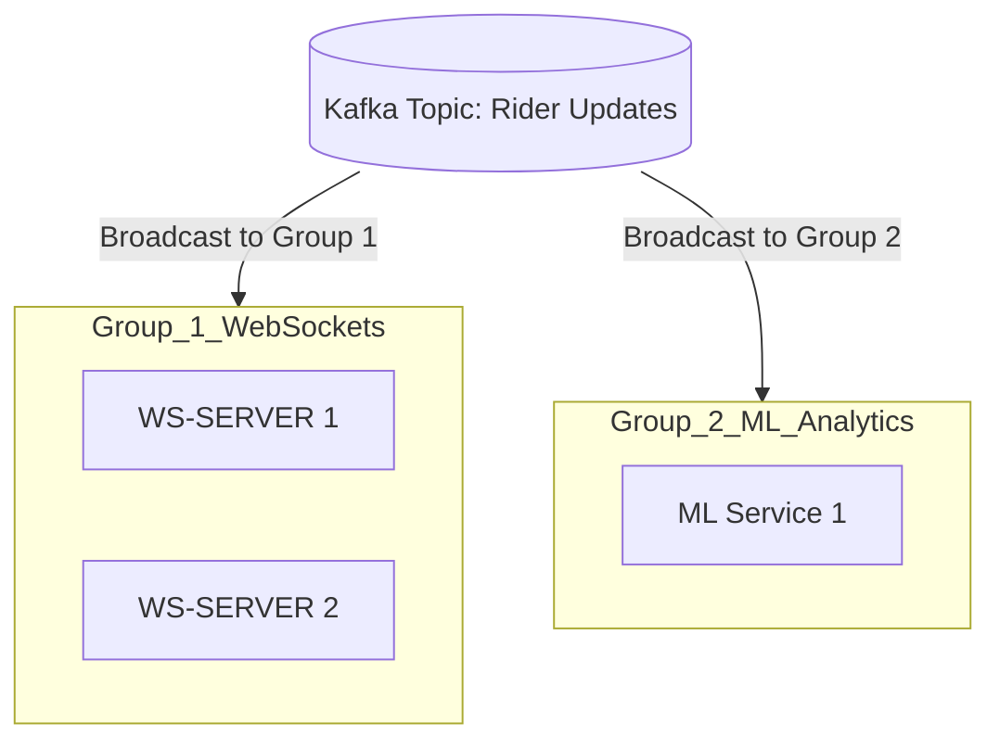

# Kafka Architecture & Event Sourcing: Scaling Real-Time Systems

## 1. Introduction: The Evolution of Messaging

Choosing the right messaging system depends on your requirements for **Ordering**, **Scale**, and **Delivery Patterns**.

| Feature | AWS SQS (Standard) | RabbitMQ (RPC) | Kafka |
| :--- | :--- | :--- | :--- |
| **Ordering** | No guarantee. | Guaranteed within a queue. | Strict order per **Partition**. |
| **Pattern** | Simple Queue (Deletable). | Request-Reply (Ack based). | Distributed Log (Fire & Forget). |
| **Persistence** | Deleted after consumption. | Optional, usually ephemeral. | Durable, replayable log. |
| **Best For** | Independent, async tasks. | Real-time RPC / Commands. | High-throughput event streams. |

### The Request-Reply Pattern (RabbitMQ / RPC)
In an RPC model, the system expects a direct response for every message sent.

---

## 2. Kafka Core: Partitioning and Ordering

Unlike simple queues, Kafka uses a **Topic-Partition** model to scale horizontally while maintaining strict order for related events.

### The Problem: Concurrent Processing vs. Order
If two workers pull "Update Location" messages for the same Rider simultaneously, a race condition occurs. One might update the map with an older coordinate after a newer one arrived.

### The Solution: The Ordering Key
Kafka uses a **Message Key** (e.g., `OrderID`) to ensure all related messages go to the same partition.

*   **Formula:** `Partition = Hash(OrderID) % Number_of_Partitions`
*   **Result:** All messages for `Order #101` always land in `Partition 1`.

> [!TIP]
> This ensures that messages relating to the **same aggregate** are processed in order, even across a massive cluster.

---

## 3. Consumer Groups: Scaling and Broadcasting

Kafka's **Consumer Groups** allow you to switch between "Queue" and "PubSub" behavior dynamically.

1.  **Queue Mode (Load Balancing):** Keep all workers in the **same Consumer Group**. Each message is sent to only **one** worker.
2.  **PubSub Mode (Broadcasting):** Put each service in a **different Consumer Group**. Every message is sent to **every** group.

---

## 4. Case Study: Zomato/Rapido Task Distribution

In a high-traffic app like Zomato, a single Rider update `{riderId, orderId, loc}` must trigger multiple independent actions. We use Kafka to "Fan-out" these events:

*   **Action 1 (WebSocket):** Update the Customer's map UI immediately.
*   **Action 2 (Database):** Log the location for audit trails.
*   **Action 3 (ML Model):** Predict ETA based on current traffic and speed.
*   **Action 4 (Notification):** If the rider is near, trigger a "Rider Arriving" push (Throttled via external systems).

By using different Consumer Groups, each service scales independently without slowing down the others.

---

## 5. Event Sourcing & State Management

**Event Sourcing** shift the focus from storing the *current state* of a record (e.g., a Database row) to storing the *full history of events* that led to that state.

### The Wallet Example
*   **Traditional DB:** You store `Balance: 4000`. If you update it 1,000,000 times, the DB becomes a bottleneck due to lock contention and transaction overhead.
*   **Event Sourcing:** You store a stream of events:
    1. `From (-) Anirudh: 2000`
    2. `To (+) Kiran: 2000`
    3. `Refund (+) 500`

### Why use Event Sourcing?
1.  **Audit Trail:** You never lose history. You can see *exactly* how a balance became what it is.
2.  **Performance:** Appending to a log (Kafka) is much faster than updating a row with ACID transactions in a heavy DB.
3.  **State Reconstruction:** You can "replay" the events from the beginning to recreate the state at any point in time.

> [!WARNING]
> While powerful, Event Sourcing introduces complexity in "Snapshotting" (periodically saving the current state so you don't have to replay millions of events every time).

---

## Summary: Designing for Resilience
*   **SQS/RabbitMQ** are perfect for discrete tasks where simple availability matters most.
*   **Kafka** is the standard for high-throughput, ordered event streams and complex system integrations.
*   **Event Sourcing** provides the ultimate auditability and performance for state-heavy applications like Wallets and Order Management.
