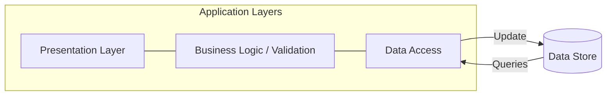
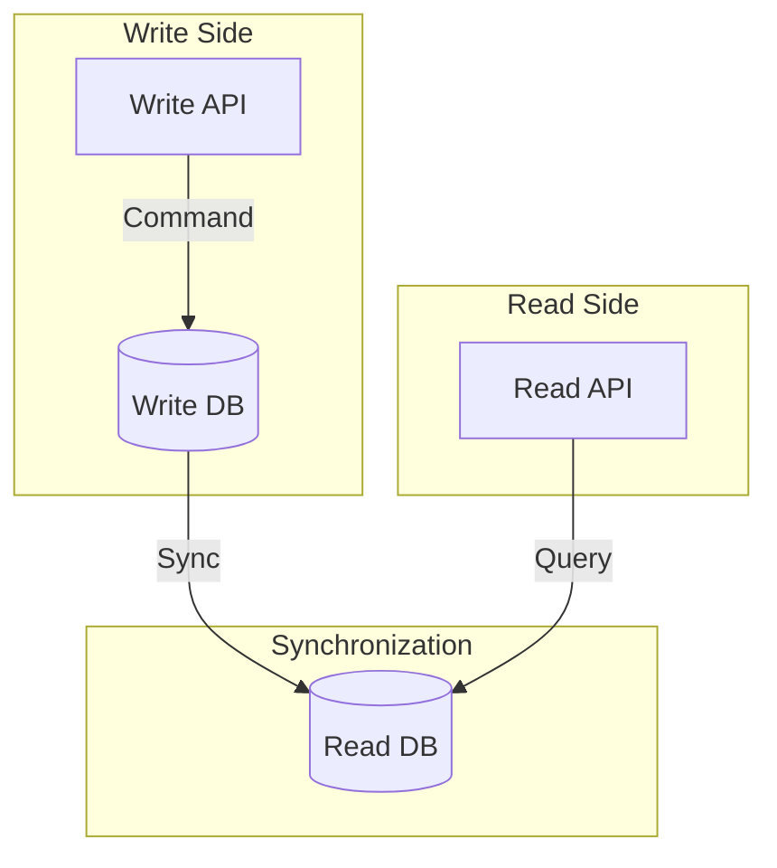

# CQRS (Command Query Responsibility Segregation) Architecture

**CQRS** stands for **Command Query Responsibility Segregation**. 

It is an architectural pattern that separates data modification (commands - write) from data retrieval (queries - read) into distinct models.

## The Problem: Traditional CRUD Architecture

Consider an Amazon E-commerce problem where the same data model is used for both Read and Write operations for basic CRUD operations.

**Diagram of Traditional Approach:**

Write operations generally need more operational resources. This traditional approach leads to several fundamental issues:

1.  **Data Mismatch:** Some fields that are required for an update might be completely unnecessary during a read operation.
2.  **Lock Contention:** Parallel operations on the same data set can cause database locking issues.
3.  **Performance Problem:** Heavy load on the data store and data access layer, alongside the complexity of queries required to retrieve info.
4.  **Security Challenges:** When entities are subjected to both read and write operations simultaneously, this overlap can expose data in unintended contexts.

## The Solution: Use CQRS

CQRS solves these problems by separating the command (write) and query (read) responsibilities.

### Understanding Commands (Writes)
This approach better captures the intent of the user and aligns commands with business processes.
*   **Example (Hotel Booking App):** Use an explicit command like `Book Hotel Room` instead of a low-level data state change like setting `ReservationStatus` to `Reserved`.

### Understanding Queries (Reads)
Queries **never** alter the data.
Instead, they simply return Data Transfer Objects (DTOs) that present the data in the required data format without incorporating any domain logic.

## CQRS Architecture with Separate Data Stores

When you use separate data stores for commands and queries, you must ensure both databases remain synchronized.

**Important Caveat:**
This architecture pattern works well only in cases where **eventual consistency** is acceptable. It is not ideal for processes that strictly require immediate, real-time updates quickly.
