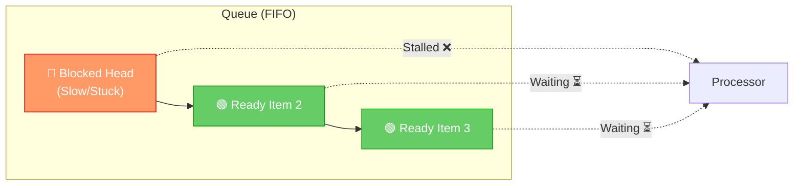

# Head-of-Line (HOL) Blocking in System Design

## What is Head-of-Line Blocking?

Imagine you're standing in a checkout queue at a supermarket. The person at the front is paying with a cheque and it's taking forever. Even though everyone behind them already has their items ready and could pay in seconds — nobody can move forward. That's **Head-of-Line (HOL) Blocking** in a nutshell.

In computer systems, **Head-of-Line (HOL) Blocking** is a performance bottleneck that happens when the **first item in a queue gets stuck**, and all the items behind it are forced to wait — even if those items are perfectly ready to be processed.

This is not a problem specific to one protocol or layer. It shows up in:
- Network switches
- HTTP/1.1 web traffic
- HTTP/2 over TCP
- Database query processing
- Message queues

---

## Simple Real-Life Analogy

Think of a **single-lane road** with cars lined up behind a traffic light. The light turns green, but the first car has broken down. Now, even though cars #2, #3, and #4 are all fine and ready to go, they can't move because car #1 is blocking the lane.

**HOL Blocking = Car #1 is broken, but it's blocking all the perfectly fine cars behind it.**

The solution? Add **more lanes** (parallel connections), or make the road **smart enough to route around** the broken car (like QUIC does).

---

## Architecture & Conceptual Overview

HOL blocking typically occurs in **buffered systems** that enforce strict ordering (FIFO — First In, First Out).

### Key Components:
| Component | What it does |
| :--- | :--- |
| **Queue / Buffer** | Holds pending requests or packets in order |
| **Processor / Transmitter** | Picks from the front of the queue and handles it |
| **Blocked Head** | The stuck item at the front — could be slow, waiting for data, or in error |
| **Waiting Tail** | All other items behind the head that are ready but can't proceed |

### Visual Flow:



> **Key insight:** Item 2 and Item 3 are GREEN — they are ready. But they cannot bypass the RED blocked head.

---

## Where Does HOL Blocking Happen?

### 1. 🌐 Networking — Input-Buffered Switches

**What happens:**
A network switch has many input ports and output ports. Multiple packets arrive from different sources, and they all want to go to different destinations.

If a switch uses a **single FIFO queue** per input port, a problem arises:
- Packet A wants to go to Output Port 1 (which is busy).
- Packet B is behind Packet A and wants Output Port 2 (which is free!).
- But Packet B is **blocked by Packet A**, even though its path is clear.

**Simple Example:**
Imagine a highway junction. Car A wants to take a left turn but there's traffic. Car B behind it wants to go straight on a clear road. But it can't move because Car A is blocking the single lane.

**Solution — Virtual Output Queues (VOQ):**
Instead of one queue per input port, maintain **one queue per output port**. Now each destination has its own lane:
- Packet A waits in the "Output Port 1" queue.
- Packet B flows freely in the "Output Port 2" queue — no blocking!

```
Without VOQ (HOL Blocking):
Input Port 1: [Packet→Out2 | Packet→Out1(BUSY)] → stuck!

With VOQ (No HOL Blocking):
Input Port 1 → Queue for Out1: [Packet]    → waiting
Input Port 1 → Queue for Out2: [Packet]    → flows freely ✅
```

---

### 2. 🌍 HTTP/1.1 — Application-Layer HOL Blocking

**What happens:**
HTTP/1.1 allows only **one request at a time** on a single TCP connection. You send a request, wait for a full response, then send the next one.

A feature called **Pipelining** was added to allow sending multiple requests without waiting. But there's a catch: the **server MUST respond in order**. So if Request #1 (a heavy database query) takes 2 seconds, Requests #2 and #3 (which are fast, maybe 10ms) are stuck behind it.

**Simple Example:**
You ask a waiter for:
1. A full 3-course meal (slow, takes 30 mins) 🍽️
2. A glass of water (ready in 10 seconds) 💧
3. The bill (can print in 5 seconds) 🧾

The waiter delivers everything **in order**. You wait 30 minutes for water, even though it was ready in 10 seconds. That's HTTP/1.1 HOL Blocking.

**Solution:**
Browsers open **6 parallel TCP connections** to the same domain. This allows 6 requests to proceed simultaneously, working around the single-connection bottleneck.

```
HTTP/1.1 on 1 connection:
→ [Req1(slow) → Res1] → [Req2(fast) → Res2] → [Req3(fast) → Res3]
   Time: ~2000ms + 10ms + 10ms = ~2020ms

HTTP/1.1 with 6 connections:
→ [Req1] on Conn1   → [Res1] (2000ms)
→ [Req2] on Conn2   → [Res2] (10ms) ✅
→ [Req3] on Conn3   → [Res3] (10ms) ✅
```

---

### 3. ⚡ HTTP/2 — Transport-Layer HOL Blocking

**What HTTP/2 fixed:**
HTTP/2 introduced **Multiplexing** — the ability to send multiple requests and responses **interleaved** over a **single TCP connection**. Each request is a "stream". This completely solves the application-layer HOL blocking.

**What HTTP/2 did NOT fix:**
HTTP/2 still runs over **TCP**. TCP is a reliable protocol — it guarantees that **every byte arrives in order**. If even **one packet** is lost somewhere on the network, TCP stops and waits for the retransmission of that single missing packet. During this wait, **all streams on the connection freeze** — even the ones that don't depend on the lost packet at all.

**Simple Example:**
Imagine 3 conveyor belts (streams) all running through a single tunnel (TCP). If one box falls off belt #2 and blocks the tunnel, all 3 belts stop — even though belts #1 and #3 had nothing to do with that box.

```
HTTP/2 Stream Blocking (1 packet lost):

Stream A: [packet1] [packet2] [LOST PACKET] [packet4] ← blocked, waiting
Stream B: [packet1] [packet2] [packet3]               ← also blocked! 😞
Stream C: [packet1]                                    ← also blocked! 😞

TCP: "I can't deliver anything until the lost packet is retransmitted."
```

---

### 4. 🚀 HTTP/3 (QUIC) — The Complete Solution

**What QUIC is:**
HTTP/3 replaces TCP with **QUIC** (Quick UDP Internet Connections). QUIC runs over **UDP**, which doesn't guarantee ordering by itself, so QUIC implements its own reliability — but **per stream**.

**How it solves HOL Blocking:**
QUIC is **stream-aware**. If a packet for Stream A is lost:
- Only **Stream A** pauses to wait for that retransmission.
- **Stream B** and **Stream C** continue delivering data to the application **uninterrupted**.

**Simple Example:**
Now imagine 3 separate tunnels instead of one shared tunnel. If something blocks Tunnel A, Tunnels B and C keep flowing freely.

```
HTTP/3 / QUIC — Packet Loss in Stream A:

Stream A: [p1] [p2] [LOST] [p4] ← only Stream A waits
Stream B: [p1] [p2] [p3]        ← continues freely ✅
Stream C: [p1] [p2]             ← continues freely ✅

Application gets Stream B and C data immediately. 🎉
```

---

## Protocol Comparison Summary

| Protocol | Built On | Blocking Type | How It's Mitigated |
| :--- | :--- | :--- | :--- |
| **HTTP/1.1** | TCP | Application Layer | Multiple parallel TCP connections (6 per domain) |
| **HTTP/2** | TCP | Transport Layer | Multiplexing solves app-layer; TCP loss still blocks all streams |
| **HTTP/3** | QUIC (UDP) | ✅ None | Per-stream reliability; packet loss only affects that stream |

---

## Real-World Examples

### 📦 Example 1: E-Commerce Homepage (HTTP/1.1)
Your browser loads `amazon.com`. The page needs 3 resources:
1. **Product Recommendations** — hits a heavy ML model → takes 3 seconds
2. **User Profile** ("Hi, Kiran!") — a simple DB lookup → ready in 20ms
3. **Cart Icon** (just a static image) → loads in 5ms

On a single HTTP/1.1 connection, if recommendations load first, you won't see your name or cart icon for 3 seconds — even though that data was ready in milliseconds.

**Fix:** Browser uses 6 parallel connections, so (2) and (3) load while (1) is still processing.

---

### 🔐 Example 2: Firewall Deep Packet Inspection
A stateful firewall needs to read and inspect complete TCP segments before allowing them through. If Packet #3 in a sequence gets lost or delayed, the firewall cannot pass Packets #4, #5, #6 to the destination — it must wait for Packet #3 to arrive and reassemble the segment in order. HOL blocking at the security layer.

---

### 🚂 Example 3: Message Queue in a Microservice
A payment service reads tasks from a Kafka queue in order:
- Task 1: Process refund (needs an external API that is slow — 10 seconds) 💤
- Task 2: Send order confirmation email (ready in milliseconds) ✉️
- Task 3: Update inventory count (ready in milliseconds) 📦

If using a single consumer with strict ordering, Tasks 2 and 3 wait for Task 1. **Solution:** Use multiple consumer threads or partitions so tasks can be processed in parallel.

---

## How to Detect HOL Blocking in Your System

- **High P99 latency** but low P50 latency — suggests some requests are blocked behind slow ones
- **CPU underutilization** while requests queue up — processor is idle waiting for the head to complete
- **Request timeout spikes** correlated with a single slow dependency
- Network analysis tools (like Wireshark) showing TCP retransmission events causing stream stalls

---

## Benefits of Solving HOL Blocking

| Benefit | Why It Matters |
| :--- | :--- |
| ⚡ **Reduced Latency** | Fast requests complete quickly instead of waiting for slow ones |
| 🖥️ **Better Resource Use** | Processors aren't idle while items wait in queue |
| 🛡️ **Fault Isolation** | One slow or failed stream doesn't cascade to others |
| 🎯 **Faster Web Performance** | Faster First Contentful Paint and Time to Interactive for users |
| 📈 **Higher Throughput** | More requests complete per second when blocking is removed |

---

## Trade-offs and Limitations

Solving HOL blocking isn't free. Here's what you pay for:

| Trade-off | Explanation |
| :--- | :--- |
| 🔧 **Increased Complexity** | QUIC and stream management are far more complex than simple FIFO queues |
| 🧠 **Memory Overhead** | VOQs and per-stream buffers require more RAM compared to a single queue |
| ⚙️ **CPU Overhead** | QUIC's encryption (always TLS 1.3) and stream management use more CPU than raw TCP |
| 🧩 **Reordering Cost** | When streams arrive out of order, the application must handle reassembly logic |
| 🌐 **Middlebox Issues** | Many corporate firewalls and proxies block or throttle UDP, which QUIC relies on |

---

## Key Takeaways

1. **HOL Blocking = the first item in a queue is stuck, and it blocks everything behind it.**
2. It happens at multiple layers: network switches, HTTP protocols, message queues.
3. **HTTP/1.1** → blocked by design; workaround is multiple TCP connections.
4. **HTTP/2** → fixed the app layer but TCP still causes transport-layer HOL blocking.
5. **HTTP/3 / QUIC** → the real fix; per-stream reliability over UDP means one loss only affects one stream.
6. In microservices, use parallel consumers, async processing, or priority queues to avoid HOL blocking in message pipelines.
