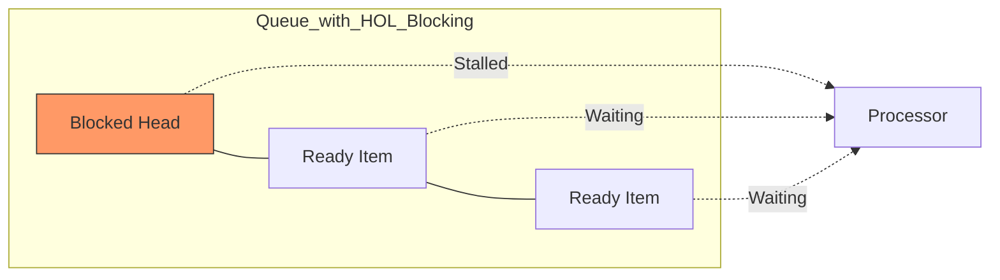

# Head-of-Line (HOL) Blocking in System Design

## Introduction
**Head-of-Line (HOL) Blocking** is a performance issue that occurs when a line (queue) of packets or requests is held up by the first one in the sequence. Even if subsequent items are ready to be processed or have a clear path forward, they must wait until the item at the "head" is resolved. This phenomenon appears at multiple layers of the system stack, from physical network switches to application-layer protocols like HTTP.

## Architecture & Conceptual Overview
HOL blocking typically occurs in buffered systems where strict ordering is enforced.

### Components:
1.  **Queue/Buffer:** A first-in-first-out (FIFO) data structure holding pending tasks or packets.
2.  **Processor/Transmitter:** The component responsible for handling the item at the front of the queue.
3.  **Blocked Head:** An item that cannot proceed due to resource contention, packet loss, or slow processing.
4.  **Waiting Tail:** Subsequent items that are perfectly fine but stuck behind the blocked head.

## Manifestation in Different Layers

### 1. Networking (Input-Buffered Switches)
In a network switch, if multiple input ports want to send data to the same output port, one will be chosen, and the others must wait. If an input port uses a single FIFO queue, a packet destined for a *busy* output port will block all packets behind it, even those destined for *idle* output ports.
- **Solution:** **Virtual Output Queues (VOQ)**, where each input port maintains a separate queue for every possible output port.

### 2. HTTP/1.1: Application-Layer HOL Blocking
HTTP/1.1 allows only one request to be outstanding on a TCP connection at a time. While "Pipelining" was introduced to send multiple requests, the server MUST respond in order. If the first request is slow (e.g., a heavy DB query), it blocks the delivery of all subsequent responses.
- **Solution:** Browsers open multiple parallel TCP connections (usually 6) to a single domain to bypass this limit.

### 3. HTTP/2: Transport-Layer HOL Blocking
HTTP/2 introduced **Multiplexing**, allowing multiple streams over a single TCP connection. This solved application-layer blocking. However, because TCP is a reliable, in-order stream, if *one* packet is lost, TCP waits for its retransmission. During this wait, all other independent HTTP/2 streams on that connection are stalled.
- **Solution:** This is the residual "Transport-Layer" HOL blocking inherent to TCP.

### 4. HTTP/3 (QUIC): The Full Solution
HTTP/3 replaces TCP with **QUIC** (running over UDP). QUIC is "stream-aware." If a packet for "Stream A" is lost, only "Stream A" stalls. "Stream B" and "Stream C" can continue to deliver data to the application layer.
- **Result:** Elimination of both application-layer and transport-layer HOL blocking.

## Comparison Summary Table

| Protocol | Layer of Blocking | Mechanism of Mitigation |
| :--- | :--- | :--- |
| **HTTP/1.1** | Application Layer | Multiple TCP Connections |
| **HTTP/2** | Transport Layer (TCP) | Multiplexing (solves app-layer only) |
| **HTTP/3** | None | QUIC (Independent Streams over UDP) |

## Real-Time Examples

### 1. Slow API Response (HTTP/1.1)
An e-commerce homepage loads a slow "Recommended Products" API first, then a fast "Current User" profile API. In HTTP/1.1 (on one connection), the user's name won't appear until the heavy recommendation engine finishes, even if the profile data was ready in 10ms.

### 2. Deep Packet Inspection / Firewalls
A stateful firewall might need to reassemble a stream to inspect it. If one packet arrives out of order or is delayed, the firewall cannot pass the subsequent packets until the missing "head" arrives to complete the segment for inspection.

## Pros of Solving HOL Blocking
*   **Reduced Latency:** Faster "First Contentful Paint" for web apps.
*   **Better Resource Utilization:** Avoids idling processors while data is sitting in a queue.
*   **Resilience:** System performance degrades gracefully when a single part of the stream fails.

## Limitations and Trade-offs
*   **Reassembly Cost:** Mitigations like QUIC require more complex logic at the application/transport layer to reassemble multiple independent streams.
*   **Memory Overhead:** Maintaining many Virtual Output Queues (VOQs) in a switch requires more buffer memory compared to a single FIFO queue.
*   **CPU Overhead:** Protocol stacks like QUIC and HTTP/2 multiplexing are more CPU-intensive than simple HTTP/1.1.
