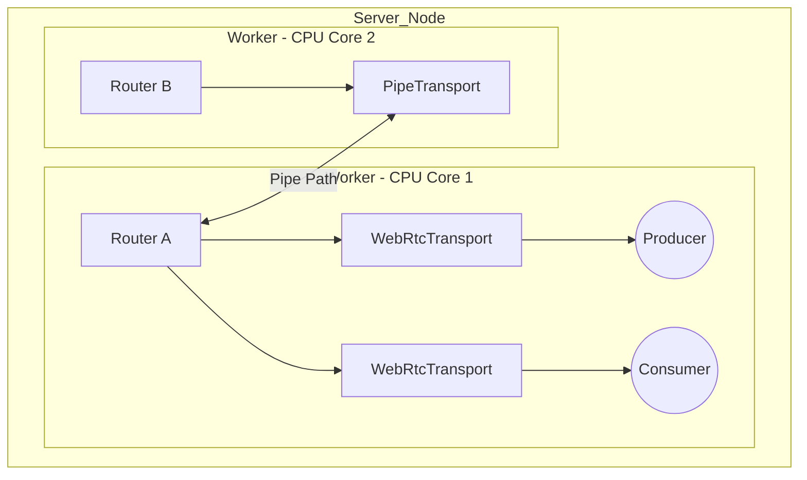

# Mediasoup SFU Architecture

## Introduction
**mediasoup** is a powerful, low-level WebRTC Selective Forwarding Unit (SFU) library designed for building high-performance real-time media applications. Unlike many other SFUs, mediasoup is unopinionated and doesn't provide a signaling protocol or application logic—it focuses purely on efficient media routing. It is built with a Node.js API that controls a high-performance C++ media engine.

## Core Architectural Components

### 1. Worker (C++ Subprocess)
The **Worker** is the core process of mediasoup. Each Worker is a single-threaded C++ subprocess that runs on a single CPU core. 
- **Efficiency:** By spawning one Worker per CPU core, mediasoup achieves massive parallelism.
- **Isolation:** If one Worker crashes, others remain unaffected.

### 2. Router (The "Media Room")
A **Router** is a logical entity within a Worker that acts as a "Virtual Room." It manages the exchange of media packets between participants.
- **Routing Logic:** It ensures that media from a Producer is sent only to interested Consumers.
- **Capabilities:** It negotiates RTP capabilities (codecs, extensions) to ensure compatibility.

### 3. Transport (The Network Path)
A **Transport** represents the connection between the Router and the outside world.
- **WebRtcTransport:** Used for browser/mobile clients (handles ICE, DTLS, SRTP).
- **PlainTransport:** Used for connecting simple RTP streams (e.g., FFmpeg, GStreamer).
- **PipeTransport:** Used for core-to-core or server-to-server media "piping."

### 4. Producer & Consumer
- **Producer:** Represents a media stream (audio or video) being sent *into* the Router.
- **Consumer:** Represents a media stream being sent *out* of the Router to a specific participant.

## Scaling Strategy

### Vertical Scaling (Multi-Core)
Since a single Worker runs on one core, it can handle a finite number of participants (typically ~500 consumers). To scale, applications spawn multiple Workers and create Routers across them.

### Horizontal Scaling (Multi-Server)
To scale beyond a single machine, we use **PipeTransport**.
1. **Pipe Layer:** When a participant on `Server A` needs to see a producer on `Server B`, the system creates a PipeTransport between the two servers.
2. **Media Relaying:** The media is "piped" from `Server B` to `Server A`, making the producer available on the local router of `Server A`.

## Handling Advanced WebRTC Features

### Simulcast and SVC
Mediasoup excels at handling **Simulcast** (Vp8/H264) and **SVC** (Vp9/L1T3). 
- The SFU does not re-encode video (no transcoding).
- Instead, it dynamically switches between different spatial and temporal layers provided by the client's encoder based on the receiver's bandwidth.

## Real-World Use Cases

### 1. Video Conferencing
Handling many-to-many meetings where each participant produces their own audio/video and consumes everyone else's.

### 2. Large Scale Broadcasting (1 to N)
A single high-quality producer is piped across dozens of servers to reach thousands of concurrent viewers with sub-second latency.

## Pros and Cons

### Pros
- **Extremely Low Latency:** Pure SFU approach with no transcoding overhead.
- **Performance:** Highly optimized C++ core with Node.js control plane.
- **Flexibility:** Can be integrated into any signaling system (WebSockets, gRPC, etc.).
- **Client Control:** Full support for modern WebRTC features like Simulcast and SVC.

### Cons
- **Complexity:** Higher learning curve compared to "plug-and-play" solutions like Jitsi.
- **Infrastructure Management:** Requires explicit management of multi-worker/multi-server logic (piping).
- **No Built-in Signaling:** Developers must build their own Room/Peer management logic.

---

## Real-Time System Fundamentals

### Latency in Video Streaming
Real-time systems require extremely low latency for interactive experiences:
- **Near Real-Time:** Single-digit latency (measured in milliseconds).
- **High Latency:** Double or triple-digit latency (> 300ms), which starts to feel disconnected for live conversations.

### Methods to Receive Updates from Server
1. **Simple Polling:** Client periodically asks the server for updates.
2. **Long Polling:** Server holds the request open until an update is available or a timeout occurs.
3. **Server-Sent Events (SSE):** A unidirectional channel where the server pushes updates to the client.
4. **WebSockets:** A full-duplex, bi-directional, long-lived communication channel.
5. **WebRTC:** Used when low-latency audio/video streaming is involved.

### Network Protocols: TCP vs. UDP

#### TCP (Transmission Control Protocol)
Uses a **3-way Handshake** for connection establishment:
1. `SYN` (Client sends sequence number)
2. `SYN-ACK` (Server responds with its own sequence and acknowledges client's)
3. `ACK` (Client acknowledges server's response)

**Key Features:**
- **Sequence Guarantee:** Ensures packets arrive in order.
- **Ack-Retransmission:** Retransmits lost packets.
- **Congestion Window:** Adapts to network conditions to prevent overloading.

#### UDP (User Datagram Protocol)
Known as "**Fire and Forget**."
- **Reliability:** No retransmissions (lower overhead, lower latency).
- **Use Cases:** DNS, DHCP, VoIP, Online Gaming, and Video Streaming (where retransmitting a late frame is useless).

---

## WebRTC Deep Dive

### The NAT Problem
Most devices are behind a NAT (Network Address Translation) and have private IP addresses, making them unreachable from the public internet. For Peer-to-Peer (P2P) communication, peers must discover each other's public IP and port.

**Solutions (ICE Framework):**
1. **STUN Server (Session Traversal Utilities for NAT):** Tells a client its public IP/Port. Works in ~80-90% of cases.
2. **TURN Server (Traversal Using Relays around NAT):** A relay server used when STUN fails (firewalls). All media flows through TURN (expensive and high bandwidth).
3. **ICE (Interactive Connectivity Establishment):** A framework that coordinates STUN and TURN to gather "candidates" (Local > STUN > TURN).

### Signaling and Session Setup
WebRTC handles media but **not** session setup. A separate **Signaling Server** (using WebSockets or Firebase) is needed to exchange:
- **SDP (Session Description Protocol):** An "Offer/Answer" exchange that describes media capabilities (codecs, resolutions).
- **ICE Candidates:** Potential network paths to reach the peer.

### WebRTC Internal Architecture
WebRTC utilizes several layers of protocols, typically over **UDP**:
- **getUserMedia:** Native browser API for camera/microphone access.
- **RTCPeerConnection:** Handles the media transport.
- **RTCDataChannel:** For low-latency data transfer.

**Protocols involved:**
- **SRTP:** Secure Real-time Transport Protocol (Encrypted media).
- **DTLS:** Datagram Transport Layer Security (Secure handshake).
- **SCTP:** Stream Control Transmission Protocol (Used by Data Channels).
- **ICE:** Connectivity checks.

---

## Modern Evolution: QUIC and HTTP/3
HTTP/3 uses the **QUIC** protocol, which is built on top of UDP. It provides **TCP-like reliability** with multiplexing and multi-streaming capabilities, effectively solving the Head-of-Line blocking problem commonly found in TCP-based HTTP/2.

