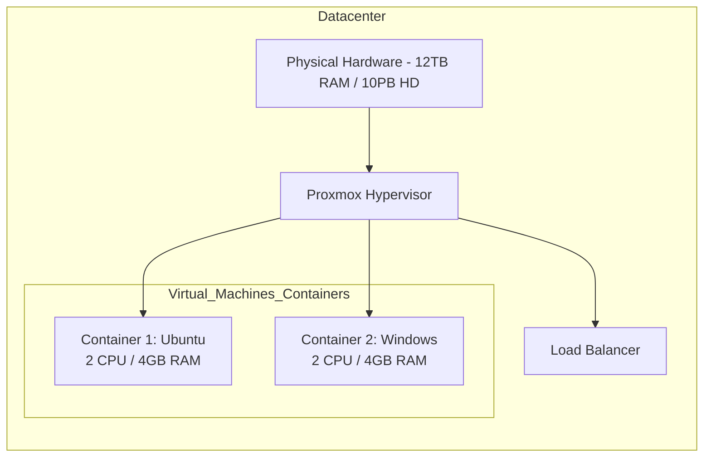

# Proxmox Virtualization (Hypervisor)

## Introduction
**Proxmox VE** (Virtual Environment) is an open-source, enterprise-grade virtualization platform. It allows for the management of virtual machines (VMs) and containers (LXC) through a comprehensive web-based interface, providing a powerful alternative to proprietary solutions like VMware.

## Infrastructure Overview
In a large-scale datacenter environment, Proxmox can manage massive hardware resources efficiently.

- **Datacenter Capacity Example:**
    - **RAM:** Up to 12 TB
    - **Hard Drive (HD):** Up to 10,234 TB
- **Storage:** Typically utilizes **SSD-based Hypervisor storage** for high I/O performance.
- **Networking:** Includes built-in **Load Balancers** and standard OS integration.

## Architecture

Proxmox acts as the Hypervisor layer, sitting on top of the physical hardware and managing multiple virtualized operating systems.

## Key Features
1. **Open Source:** Enterprise-grade features without vendor lock-in.
2. **Web Interface:** Manage your entire virtual infrastructure (VMs, containers, storage, networking) through a browser.
3. **Hyper-Converged:** Integrates compute, storage, and networking into a single solution.
4. **Variety of OS Support:** Seamlessly run diverse environments like Ubuntu, Debian, Windows, and more on a single platform.

## Summary
Proxmox provides a robust, scalable, and manageable environment for modern datacenters, allowing IT administrators to maximize hardware utilization through efficient virtualization and containerization.
