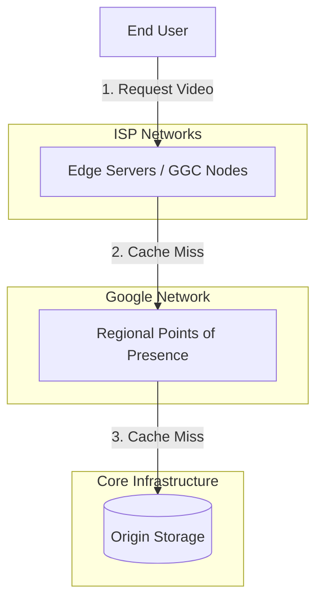

# YouTube System Design: Multi-Tier CDN Architecture

To deliver billions of hours of video content daily with minimal buffering, YouTube relies on a highly optimized, multi-tier Content Delivery Network (CDN) strategy known as the **"CDN All"** approach.

---

## 1. The Scale & The Problem

At YouTube's scale, serving video from a central location is impossible. 
- **Bandwidth Costs:** Pulling petabytes of data across transit providers is prohibitively expensive.
- **Latency:** Distance causes packet loss and jitter, leading to buffering.
- **Traditional CDNs:** Relying solely on third-party CDNs (like Akamai or Cloudflare) would cost billions.

**Solution:** Build a proprietary, multi-tiered edge caching infrastructure integrated directly into ISP networks.

---

## 2. The Multi-Tier Caching Hierarchy

YouTube divides its content delivery into three distinct tiers to balance storage costs with delivery speed.

### Tier 3: Edge Nodes (Google Global Cache - GGC)
*   **Location:** Deployed *inside* the facilities of Internet Service Providers (ISPs).
*   **Role:** Serve the most popular content (trending videos, viral hits).
*   **Benefit:** Zero transit costs for YouTube, and ultra-low latency for users since the data never leaves the ISP's network.

### Tier 2: Regional PoPs (Points of Presence)
*   **Location:** Major internet exchange points globally.
*   **Role:** Act as a middle layer. If a video is not in the local GGC, the request hits the nearest Regional PoP.
*   **Benefit:** Aggregates traffic and shields the origin from massive spikes.

### Tier 1: Origin (Core Data Centers)
*   **Location:** Massive Google Data Centers (e.g., Bigtable, GCS).
*   **Role:** The ultimate source of truth for all videos, including the long-tail (rarely watched) content.

---

## 3. The "CDN All" Strategy & Request Flow

When a user clicks play, the architecture ensures maximum cache hits:

1.  **DNS & Anycast Routing:** The user's request is routed to the closest GGC node via Anycast IP routing.
2.  **Manifest Fetch:** The client fetches the `.m3u8` or `.mpd` manifest file.
3.  **Chunk Delivery:** The video player requests individual 5-second chunks (`.ts` or `.m4s`).
4.  **Fallback Logic:**
    *   If chunk is in **GGC** -> Served immediately (Fastest).
    *   If **Miss** -> GGC fetches from **Regional PoP** and caches it.
    *   If **Miss** -> PoP fetches from **Origin**.

---

## 4. Advanced CDN Optimizations

### A. Predictive Caching (Pre-positioning)
YouTube doesn't just wait for users to request videos. 
*   **ML Models** predict what videos will be popular in specific regions based on watch history, subscriptions, and time of day.
*   **Background Pushing:** These videos are pre-cached to GGC nodes during off-peak hours (e.g., 2 AM).

### B. Protocol Optimization (QUIC / HTTP/3)
*   Traditional TCP suffers from Head-of-Line Blocking (if one packet drops, the stream pauses).
*   YouTube uses **QUIC (UDP-based)** to allow multiplexed streams, drastically reducing connection setup time and buffering on mobile networks.

---

## 5. Summary of Components

| Component | Tier | Storage Type | Content Cached |
| :--- | :--- | :--- | :--- |
| **GGC Nodes** | Tier 3 (Edge) | SSDs (Fast/Limited) | Viral, Trending, Local Hits |
| **Regional PoPs** | Tier 2 (Middle) | Mixed HDD/SSD | Medium-tail content |
| **Origin** | Tier 1 (Core) | Cold Storage / Tape | Long-tail, All Originals |

---

## Conclusion

YouTube's success is built on the assumption that network bandwidth is the ultimate bottleneck. By pushing content as close to the user as physically possible (inside the ISP) and using intelligent predictive caching, YouTube achieves a buffer-free experience at an unprecedented scale.
