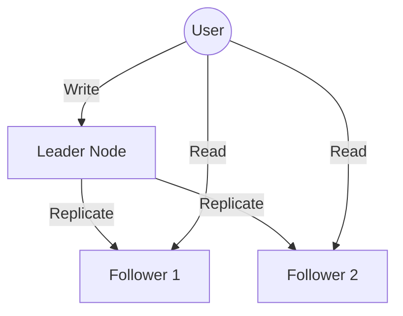
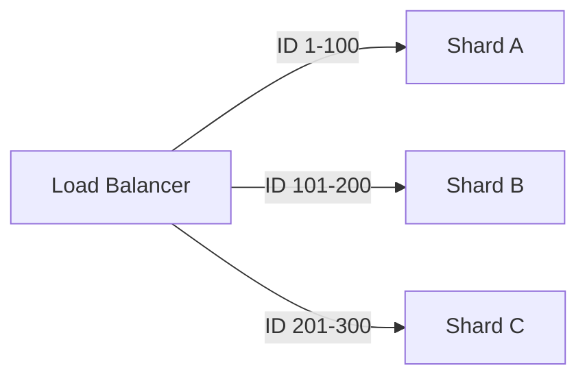

# Distributed Databases: Scaling Beyond One Machine

## Introduction: The "Single Point of Failure"

In the early days of the web, you could run your entire business on a single database server. But as your user base grows from hundreds to millions, a single machine becomes a bottleneck and a massive risk. If that one server crashes, your entire business goes dark.

To build modern, resilient systems, we must master **Distributed Databases**.

---

## Part 1: Replication (The "Safety Net")

Replication is the process of keeping copies of the same data on multiple machines.

*   **Leader-Follower:** One "Leader" handles writes, while "Followers" synchronize and handle reads.
*   **Multi-Leader:** Useful for systems spanning multiple continents to reduce latency.
*   **Leaderless:** Systems like Cassandra where every node can accept writes.

**Why Replicate?**
1.  **High Availability:** If the leader dies, a follower can take over.
2.  **Latency:** Serve users from a server physically closer to them.
3.  **Read Scaling:** Handle millions of read requests by spreading them across followers.

---

## Part 2: Sharding (The "Divide and Conquer")

When your data becomes too big to fit on even the largest hard drive, you need **Sharding** (also known as Horizontal Partitioning).

*   **How it works:** You split your data into smaller chunks called "Shards." For example, users with IDs 1-1000 go to Shard A, and 1001-2000 go to Shard B.
*   **The Key:** Choosing a **Shard Key** is critical. A bad key leads to "Hotspots" (where one server does all the work while others stay idle).

### Re-sharding: The Growing Pains
As your system grows, your initial shards might get full. Re-sharding is the complex process of moving data between servers without taking the system offline.

---

## Part 3: Point-In-Time Recovery (The "Time Machine")

Data loss is inevitable—whether through hardware failure or human error (like accidentally running `DROP TABLE`). 

**Point-In-Time Recovery (PITR)** allows you to restore your database to the exact second before the disaster happened. It works by combining a "Full Backup" with a continuous "Transaction Log" (WAL - Write Ahead Log).

---

## Part 4: Eventual Consistency

In a distributed system, updates take time to travel across the network. 

*   **The Reality:** If you update your profile picture, your friend might still see the old one for a few seconds.
*   **The Trade-off:** We accept **Eventual Consistency** to ensure the system stays fast and available even during network hiccups.

---

## Revision Summary

| Topic | Key Concept | Why it matters |
| :--- | :--- | :--- |
| **Replication** | Copying data across nodes | High Availability & Read Scaling |
| **Sharding** | Splitting data by key | Unlimited Storage & Write Scaling |
| **PITR** | Restore to specific second | Protection against disaster/human error |
| **Consistency** | Eventual vs. Strong | Trade-off between Speed and Correctness |

## Conclusion

Distributed databases are the backbone of the modern internet. By combining replication for safety and sharding for scale, we create systems that can survive city-wide power outages and handle the traffic of the entire world.
