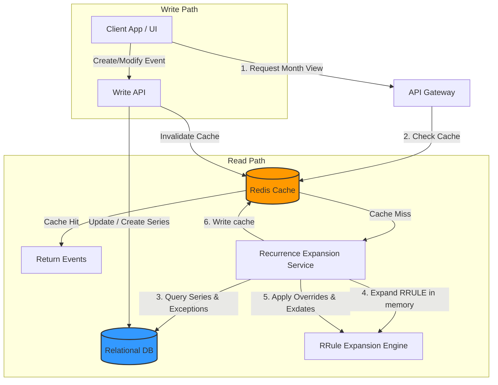

# Calendar System Design: Designing Recurring Events (Google Calendar & Outlook)

Designing a calendar system that supports **recurring events** (e.g., "every Monday at 9:00 AM" or "the last Friday of every month") is a classic system design question. It requires balancing storage efficiency, read-path latency, and timezone complexities.

This article details how systems like **Google Calendar** and **Microsoft Outlook** design, store, and query recurring events at scale.

---

## 1. The Core Architectural Challenge

When designing a calendar system, there are two naive ways to handle recurring events, both of which fail at scale:

### Option A: Pre-generation (Materialization)
Store every single occurrence of a recurring series as a separate row in the database.
*   **The Problem:** If a user creates a daily meeting with "no end date," the system would have to write an infinite number of rows. Even if capped at 5 years, updating the series (e.g., changing the meeting room or shifting the time by 30 minutes) requires modifying thousands of database records, leading to massive write amplification and transaction locks.

### Option B: Pure Dynamic Expansion
Only store the recurrence pattern. When a user queries their calendar, read the pattern, generate every instance dynamically in memory, and display it.
*   **The Problem:** This is computationally expensive, especially for complex rules (e.g., "every 2nd Tuesday of the month"). If a user has hundreds of recurring events, expanding them on the fly for a 30-day view on every page load will exhaust CPU resources and cause high latency.

### The Solution: The Hybrid Approach
Modern calendar systems use a **hybrid approach**:
1.  **Store the Recurrence Intent:** Store the recurring event once in a master table, describing its pattern using the standardized **iCalendar (RFC 5545) RRULE** format.
2.  **Store Exceptions/Overrides Separately:** If a single occurrence is modified (e.g., rescheduled to a different hour) or deleted, store only that specific deviation (the "exception") in a separate table.
3.  **Lazy Expansion with Caching:** Calculate occurrences dynamically for the requested time range (e.g., a month) and cache the expanded instances in an in-memory database like **Redis** to speed up subsequent reads.

---

## 2. Standardizing Recurrence: RFC 5545 (iCalendar)

Rather than inventing a custom database schema to represent complex repetition patterns, the industry standard is **RFC 5545 (iCalendar)**. This specification defines a **Recurrence Rule (RRULE)** string.

### Anatomy of an RRULE String
*   `FREQ=DAILY;COUNT=10` (Repeat daily for 10 times)
*   `FREQ=WEEKLY;BYDAY=MO,WE,FR;UNTIL=20261231T235959Z` (Repeat weekly on Mondays, Wednesdays, and Fridays until December 31, 2026)
*   `FREQ=MONTHLY;BYDAY=-1FR` (Repeat monthly on the last Friday of the month)

---

## 3. Database Schema Design

To support the hybrid approach, we split our storage into two main tables: **Event Series** (the parent) and **Event Exceptions** (the overrides).

### 1. `event_series` Table
Stores the parent/root configuration of the recurring series.

| Column Name | Type | Description |
| :--- | :--- | :--- |
| `id` | UUID | Primary key |
| `user_id` | UUID | Owner of the calendar |
| `title` | VARCHAR | Title of the event |
| `description` | TEXT | Description |
| `local_start_time` | TIME | Time of day the event starts (e.g., `09:00:00`) |
| `duration_minutes` | INT | Duration of the meeting (e.g., `60` minutes) |
| `start_date` | DATE | Date when the series begins (e.g., `2026-06-01`) |
| `timezone` | VARCHAR | The home timezone (e.g., `America/New_York`) |
| `rrule` | VARCHAR | The RFC 5545 rule string (e.g., `FREQ=WEEKLY;BYDAY=MO`) |
| `exdates` | TEXT | Array of exclusion dates (dates where an instance is deleted/skipped) |

### 2. `event_exceptions` Table
Stores instances within the series that deviate from the master pattern (e.g., changing the title or time of a single occurrence).

| Column Name | Type | Description |
| :--- | :--- | :--- |
| `id` | UUID | Primary key |
| `series_id` | UUID | Foreign key referencing `event_series.id` |
| `recurrence_id` | TIMESTAMP | The *original* start time of the instance before override |
| `actual_start_time`| TIMESTAMP | The *new* rescheduled start time |
| `actual_end_time` | TIMESTAMP | The *new* rescheduled end time |
| `title_override` | VARCHAR | Nullable. Title override |
| `is_cancelled` | BOOLEAN | If true, this occurrence is deleted/hidden |

---

## 4. The Architecture & Read/Write Flows

### The Read Path (Querying a Date Range)
When a user views their calendar for July 1, 2026 to July 31, 2026:
1.  **Cache Lookup:** Query **Redis** for the user's expanded events in July 2026.
2.  **Database Fetch (on Cache Miss):**
    *   Query `event_series` where `user_id = ?` and the series duration overlaps with July.
    *   Query `event_exceptions` for these series IDs.
3.  **Expansion Engine:**
    *   The `Recurrence Expansion Service` uses a library (like `rrule.js` or standard library wrappers) to generate all valid start times for each series in July.
4.  **Exceptions Merging:**
    *   For each generated occurrence, check if there is a matching date in the series' `exdates` list. If so, discard it.
    *   Check if there is an override in `event_exceptions` matching the `recurrence_id` (original time). If found, replace the default occurrence details with the overridden details (e.g., new time, new title).
5.  **Cache & Return:** Store the resolved list in Redis with a TTL (e.g., 24 hours) and return it to the client.

### The Write Path (Modifying Events)
There are three ways a user can modify a recurring event.

#### Case 1: "Only this event" (Single Instance Override)
*   **Operation:** The user reschedules tomorrow's meeting from 9:00 AM to 11:00 AM.
*   **Database action:**
    1. Insert a record into `event_exceptions`.
    2. Set `series_id = <parent_id>`.
    3. Set `recurrence_id = 2026-06-17T09:00:00` (the original slot).
    4. Set `actual_start_time = 2026-06-17T11:00:00` (the new slot).
*   **Cache action:** Evict cache keys for the affected user for the month of June.

#### Case 2: "All future events" (Series Split)
*   **Operation:** The user decides that starting today, all future meetings in this weekly series will happen at 10:00 AM instead of 9:00 AM.
*   **Database action:**
    1. Update the original series: Set `rrule.UNTIL = <yesterday>`.
    2. Create a **new** series row: Set `start_date = <today>`, `local_start_time = 10:00:00`, and clone the `rrule` pattern.
*   **Cache action:** Evict future cache keys.

#### Case 3: "All events in the series" (Full Update)
*   **Operation:** The user changes the name of the meeting for past and future.
*   **Database action:** Update the `title` in the `event_series` parent table. If any `event_exceptions` had a title override, keep them or prompt the user if they should be overridden.
*   **Cache action:** Evict all cache keys for this series.

---

## 5. Critical Edge Case: Timezones and Daylight Saving Time (DST)

Handling timezones is the most complex part of recurring calendar events. 

### The UTC Trap
It is a common practice to convert all times to **UTC** before storing them in a database. **Do not do this for recurring events.**
*   *Why?* Let's say a user in New York schedules a daily standup at 9:00 AM local time.
*   In winter (Standard Time), 9:00 AM New York is **14:00 UTC**.
*   In summer (Daylight Saving Time), 9:00 AM New York is **13:00 UTC**.
*   If you store the series start time as `14:00 UTC` and expand it daily using UTC offsets, the meeting will shift to 10:00 AM local New York time in the summer!

### The Solution: Wall-Clock Storage
To prevent timezone shifting, store:
1.  The local start time (wall-clock time) as a timezone-agnostic value (e.g., `09:00:00`).
2.  The IANA Time Zone database name (e.g., `America/New_York`).
3.  Expand the rules in local time, and *then* convert the individual occurrences to UTC timestamps dynamically based on the historical and future DST transitions of that specific timezone.

---

## 6. High-Scale Optimizations

### 1. Indexed Lookup Windows
To keep queries fast, limit the expansion window. Google Calendar and Outlook do not query rules infinitely. They limit search queries or UI views to a maximum range (e.g., 2 years into the future). 

### 2. Search Indexing (Elasticsearch/Solr)
If a user searches for the word "Feedback" in their calendar, you cannot expand every recurring event in history to see if it matches. 
*   **Solution:** Pre-expand and index instances for a sliding window (e.g., past 1 year, future 2 years) into a search index (like Elasticsearch). For recurring events that extend past the window, index the series metadata and run dynamic expansions for rare deep searches.

### 3. Fan-out for Group Invitations
If a recurring event has 50 attendees, do not expand the event 50 times.
*   **Solution:** The database stores one master event series owned by the organizer. The attendees' calendars store a reference pointer to this master series. The Expansion Engine resolves the pointers, caches the result, and serves the correct unified instances to all invitees.

---

## Conclusion

A robust recurring event system relies on standardizing data with **RFC 5545 RRULEs**, utilizing a **hybrid database layout** that isolates exceptions from the parent rule, and handling timezones using **wall-clock time**. By implementing a smart caching strategy via Redis and capping the expansion window, your calendar service can handle millions of events efficiently without CPU bottlenecks.
