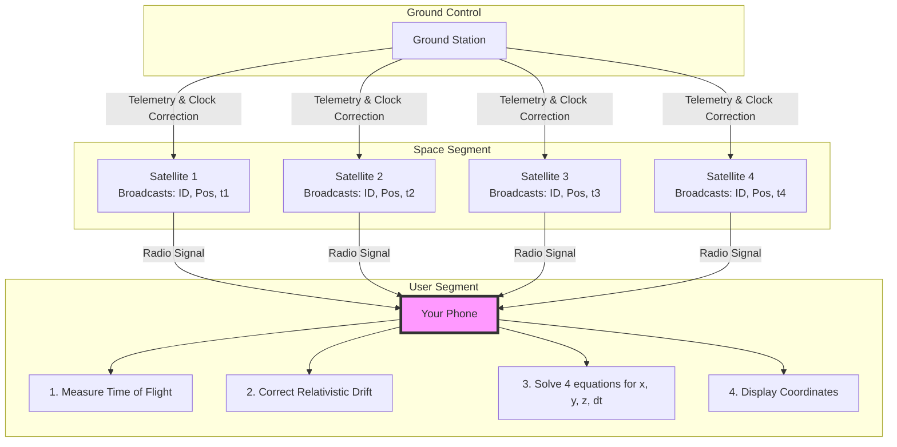

# How GPS Works: Why Satellites Don't Know You Exist

When you open Google Maps or Uber, your phone shows your location down to the exact street corner. It is easy to assume that your phone is communicating back and forth with GPS satellites. 

In reality, **GPS satellites have absolutely no idea you exist.** GPS is a strictly one-way, receive-only communication system. 

Here is the deep technical breakdown of how GPS works, the mathematics of trilateration, the clock synchronization problem, and why the system would fail within hours without Einstein’s Theory of Relativity.

---

## 1. The Core Architecture: One-Way Passive Ranging

The Global Positioning System (GPS) consists of three major segments:
1.  **Space Segment:** A constellation of 24+ active satellites orbiting Earth at an altitude of approximately 20,000 km.
2.  **Control Segment:** Ground tracking stations that monitor and update satellite orbits and clock drifts.
3.  **User Segment:** Your phone or any GPS receiver.

### The Broadcast Protocol
Each satellite does exactly one thing: it continuously broadcasts a radio signal containing:
*   Its precise position in space (orbital parameters, known as the **Ephemeris**).
*   The exact timestamp of when the signal was sent.

Your phone transmits **nothing** back to the satellites. If 1 billion phones are using GPS at the same time, the load on the satellites is exactly the same as if zero phones were using it.

---

## 2. The Math: From Spheres to Coordinates (Trilateration)

Since the signals travel at the speed of light (\(c \approx 3 \times 10^8 \text{ m/s}\)), your phone calculates its distance from a satellite by measuring the signal's Time of Flight (ToF):

\[\text{Distance} = (\text{Time Received} - \text{Time Sent}) \times c\]

### The Geometry of Trilateration
To determine your exact 3D coordinates (latitude, longitude, and altitude), your phone uses **Trilateration**:

1.  **One Satellite:** A single distance measurement places you somewhere on the surface of a giant sphere centered on that satellite, with a radius equal to the calculated distance.
2.  **Two Satellites:** Introducing a second satellite creates a second sphere. The intersection of two spheres is a **flat circle**. You are somewhere on this circle.
3.  **Three Satellites:** Adding a third satellite creates a third sphere. Three spheres intersect at exactly **two points**.
    *   One of these points is deep in space or underground.
    *   The other point is on Earth's surface. 
    *   By discarding the impossible space coordinate, three satellites are mathematically sufficient to identify your location.

---

## 3. Why Three Satellites Aren't Enough: The Clock Bias Problem

While three satellites work in perfect geometry, they assume your phone's clock is perfectly synchronized with the atomic clocks on the satellites. 

GPS satellites carry ultra-precise, $100,000 atomic clocks. Your phone uses a cheap quartz crystal clock. 

If your phone's clock is off by even **1 microsecond** (one-millionth of a second), the distance calculation will be off by:

\[1 \mu\text{s} \times 300,000 \text{ km/s} = 300 \text{ meters}\]

If your phone is off by a millisecond, your GPS will place you in a different city.

### The 4th Equation
To solve this, your phone treats its own clock error (clock bias, denoted as \(t_b\)) as an unknown variable. Instead of solving for just three dimensions \((x, y, z)\), it solves for four variables: \((x, y, z, t_b)\).

For this, your phone needs a **minimum of 4 satellites** to generate a system of 4 equations:

\[(x - x_i)^2 + (y - y_i)^2 + (z - z_i)^2 = (c \cdot (t_{\text{recv}, i} - t_{\text{sent}, i} - t_b))^2\]

*(Where \(i\) is the satellite index from 1 to 4)*

By solving this system, your phone determines your exact position **and** aligns its cheap quartz clock with the satellite's atomic clock.

---

## 4. Einstein's Relativity: Preventing Total Drift

The most mind-blowing aspect of GPS is that it is a live demonstration of Einstein’s Theories of Relativity. Without relativistic corrections, GPS positioning would drift by **11 kilometers every single day**, rendering it useless.

Two relativistic effects compete here:

### 1. Special Relativity (Velocity Effect)
*   **The Principle:** Moving clocks run slower.
*   **The Math:** Satellites travel at roughly 14,000 km/h relative to Earth. Because of this speed, their clocks run slower compared to clocks on Earth.
*   **The Drift:** Slower by about **7 microseconds per day**.

### 2. General Relativity (Gravity Effect)
*   **The Principle:** Gravity curves spacetime. Clocks closer to a massive body (like Earth) run slower because gravity is stronger.
*   **The Math:** Satellites are 20,000 km up, experiencing only a fraction of Earth's gravity. Because they are in weaker gravity, their clocks tick faster.
*   **The Drift:** Faster by about **45 microseconds per day**.

### The Net Relativistic Drift
Combining both effects:

\[\Delta t = +45 \mu\text{s} \text{ (General)} - 7 \mu\text{s} \text{ (Special)} = +38 \mu\text{s per day}\]

Without correction, satellite clocks would get ahead of Earth clocks by 38 microseconds per day. Since light travels at 300 meters per microsecond, the GPS location calculations would drift by:

\[38 \mu\text{s} \times 300 \text{ m/}\mu\text{s} \approx 11.4 \text{ km/day}\]

### The Solution
Before launching satellites into orbit, engineers deliberately program the onboard atomic clocks to tick slightly slower (at **10.22999999543 MHz** instead of the standard **10.23 MHz**). Once in orbit, the combination of special and general relativity accelerates the clocks to exactly **10.23 MHz**, perfectly aligning them with Earth.

---

## Summary of GPS Data Processing

| Challenge | Mathematical Cause | Solution |
| :--- | :--- | :--- |
| **No transmission from receiver** | Passive, receive-only architecture | One-way Time of Flight ranging |
| **3D Localization** | Sphere intersections | Trilateration using at least 3 spheres |
| **Quartz Clock Error** | Speed of light magnification ($1\mu s = 300m$) | 4th satellite adds a 4th equation to solve for clock bias ($t_b$) |
| **Time Dilation** | Special & General Relativity ($+38\mu s/\text{day}$) | Pre-setting clocks slower before launch |

<!-- updated -->
