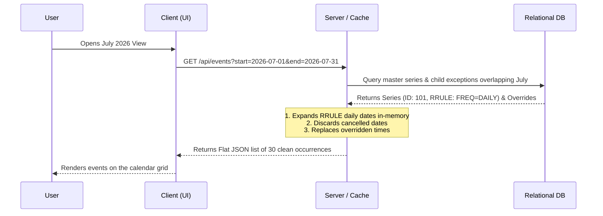
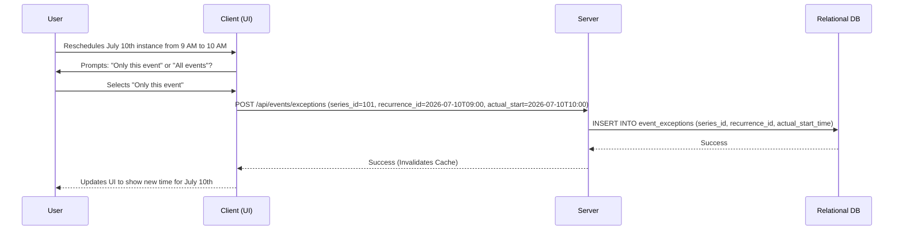

# Recurring Events: Frontend vs. Backend Division of Labor

When designing a calendar or task system with recurring events, a critical question arises: 

> **Does the database create a separate record for every daily instance of a never-ending task?**

The short answer is **No**. Doing so would cause database bloat and severe write amplification. Instead, modern systems use a **hybrid approach** with a clear division of labor between the Frontend and the Backend.

---

## 1. The Division of Labor

Here is how the frontend and backend divide responsibilities to manage and display recurring events:

### The Backend (The "Brain")
The backend is responsible for storing data efficiently, performing recurrence calculations, and caching results:
*   **Storage (Series & Exceptions):** It stores the recurrence rule (e.g., standard iCalendar `RRULE` strings like `FREQ=DAILY;INTERVAL=1`) **only once** in a master table (`event_series`). It only writes individual child records when there is a deviation/override (e.g. canceling or rescheduling a single instance) in a child table (`event_exceptions`).
*   **Lazy In-Memory Expansion:** When requested, the backend reads the parent pattern and dynamically generates the occurrences for the requested time window (e.g., a month view) in-memory using an expansion engine.
*   **Exception Merging:** It merges the generated dates with any overrides from the child tables (e.g. replacing default event titles or times, or removing deleted/cancelled dates) before returning the list.
*   **Caching:** It caches the expanded lists (e.g., in Redis) to ensure subsequent read requests are resolved instantly.

### The Frontend (The "Viewer")
The frontend is kept simple and lightweight. It only handles rendering and user input:
*   **Requesting a Date Range:** It tells the backend which dates are currently visible on the screen and what timezone the user is in.
*   **Simple Rendering:** It receives a **flat JSON list** of pre-calculated, ready-to-display occurrences from the backend. The frontend does not parse `RRULE` strings or compute time zone transitions; it simply plots the flat list of dates on the grid.
*   **Prompting Options:** When a user modifies an event, the frontend shows a modal prompting: *"Edit only this occurrence"* or *"Edit the entire series"*.
*   **Sending Specific Commands:** Based on the user's choice, it calls the corresponding backend API endpoint (e.g. creating an exception record for a single occurrence change).

---

## 2. Dynamic Flow of Data

Here is how the read and write paths interact dynamically between the Client (Frontend) and Server (Backend):

### Read Path: Viewing the Calendar

### Write Path: Modifying a Single Occurrence

---

## 3. Comparison Summary

| Action | Frontend Role | Backend Role | Database Change |
| :--- | :--- | :--- | :--- |
| **Initial Load** | Sends date range to fetch. | Fetches series, expands RRULE, applies exceptions. | None (Read only). |
| **Display Events** | Iterates over the flat list and draws bubbles. | Serves the flat array from cache or DB. | None (Read only). |
| **Edit Single Day** | Prompts user, sends exception payload to API. | Validates and saves the exception details. | **INSERT/UPDATE** in child exceptions table. |
| **Edit Entire Series** | Sends updated series details to API. | Updates the parent record, clears cached lists. | **UPDATE** in parent series table. |
