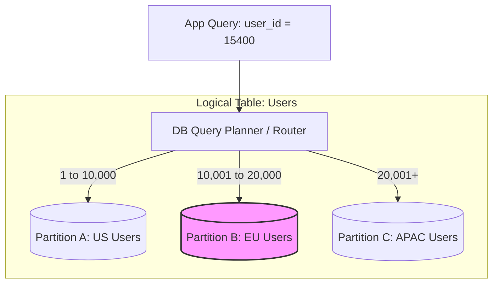

# Database Partitioning: Scaling Tables Beyond Their Limits

A single database server works perfectly fine in the beginning. But as your system grows, a single table might grow to hundreds of millions or billions of rows. When this happens:
*   **Queries slow down:** Even with indexes, B-tree indexes grow so large they no longer fit in RAM, forcing slow disk reads.
*   **Writes get sluggish:** Inserting new rows requires updating massive index structures, causing write lock contention.
*   **Maintenance becomes impossible:** Backing up or running a schema migration on a multi-terabyte table can take hours or even days.

To scale beyond these limits, we use **Database Partitioning**.

---

## 1. What is Database Partitioning?

Database partitioning is the process of splitting a single logical table into smaller, self-contained physical chunks called **partitions**. 

While the database engine manages these partitions under the hood, your application queries the table as if it were still a single entity. The database automatically routes reads and writes to the correct partition.

---

## 2. Horizontal vs. Vertical Partitioning

You can partition a table in two directions:

### A. Horizontal Partitioning (Rows)
You split the table by **rows**. For example, users from the US go to one partition, and users from Europe go to another. Each partition has the exact same columns but holds a subset of the rows. This is the most common form of partitioning and is the foundation of database **Sharding**.

### B. Vertical Partitioning (Columns)
You split the table by **columns**. 
*   **Example:** If you have a `users` table with columns `id`, `username`, `email`, and `profile_picture_blob`, you might split it into two tables:
    1.  `users_metadata` (`id`, `username`, `email`)
    2.  `users_blobs` (`id`, `profile_picture_blob`)
*   **Why?** This keeps the main metadata table narrow and highly performant in memory, since large binary blobs are stored elsewhere.

---

## 3. Partitioning Strategies

To partition horizontally, you must choose a **Partition Key** and a strategy to distribute the data:

| Strategy | How it Works | Best Used For |
| :--- | :--- | :--- |
| **Range Partitioning** | Assigns data to partitions based on a continuous range of values. | **Time-series data** (e.g., creating a new partition for every month: `logs_jan`, `logs_feb`). |
| **List Partitioning** | Assigns data based on a predefined list of explicit values. | **Categorical data** (e.g., partitioning by country code: `US`, `IN`, `GB`). |
| **Hash Partitioning** | Applies a hash function to the key (e.g., `hash(user_id) % 4`) to yield a partition index. | **Even distribution** of writes across a fixed number of partitions. |

---

## 4. Where Developers Get Confused

### Partitioning vs. Sharding
*   **Partitioning** is a generic term for splitting data. Usually, when developers say "table partitioning," they mean splitting data **on the same machine** (local partitioning in PostgreSQL or MySQL) to keep index sizes manageable.
*   **Sharding** is horizontal partitioning where the partitions (shards) are distributed **across different physical servers/nodes** over a network.

### The Trade-off: Cross-Partition Queries
If you query the database using the partition key (e.g., `WHERE user_id = 15400`), the database planner routes the query directly to one partition. 

However, if you query without the partition key (e.g., `WHERE email = 'alex@example.com'`), the database must perform a **scatter-gather query**, searching every single partition to find the data. This is extremely slow and defeats the purpose of partitioning.

---

## 5. Quick Quiz: The Key Selection Dilemma

> [!IMPORTANT]
> **Question:** If you partition your social media application's data by `user_id`, what problem can still happen?
> 
> *   **A)** Uneven data distribution
> *   **B)** Hot partitions
> *   **C)** One server overloaded
> *   **D)** All of the above

### Correct Answer: **D) All of the above**

**Why?**
If you partition strictly by `user_id`, you assume all users generate equal amounts of traffic and data. In reality, a "Celebrity User" (e.g., a popular influencer with millions of followers) will produce orders of magnitude more activity, posts, and comments than an average user. 

This leads to:
1.  **Uneven data distribution (Data Skew):** The partition containing the celebrity's data will grow massively compared to others.
2.  **Hot Partitions:** Whenever the celebrity posts, millions of users will read/write to that single partition simultaneously.
3.  **Server Overload:** If those partitions reside on different machines (sharding), the specific server hosting the celebrity's partition will crash under the load, while other servers remain idle.
