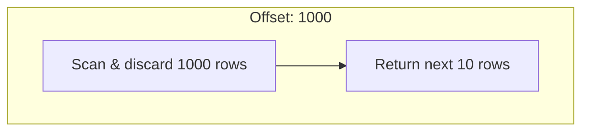
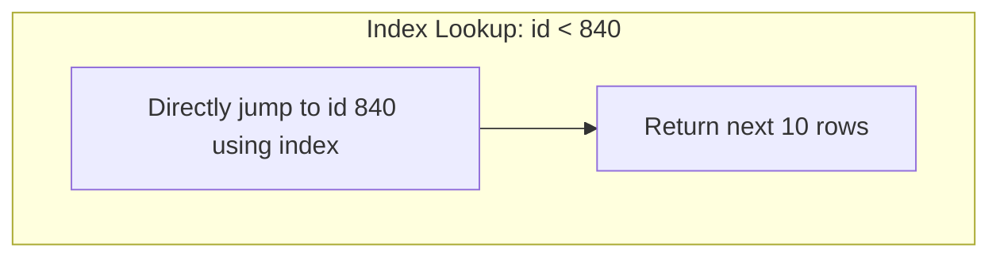

# Database Pagination: Offset vs. Cursor-Based Pagination

When designing APIs that fetch large lists of data (like a social media feed, search results, or e-commerce products), you cannot return millions of records in a single response. Doing so would crash the database, consume massive network bandwidth, and freeze the client application.

To solve this, we use **Pagination**—returning data in small, manageable chunks (pages).

There are two primary ways to design database pagination: **Offset-based** and **Cursor-based**.

---

## 1. Offset-Based Pagination (The Traditional Way)

Offset pagination is the most common approach. It uses standard SQL `LIMIT` and `OFFSET` clauses.

### How it works
The client requests a specific page size (`limit`) and a starting point (`offset`):
*   **Page 1:** `SELECT * FROM posts ORDER BY created_at DESC LIMIT 10 OFFSET 0;`
*   **Page 2:** `SELECT * FROM posts ORDER BY created_at DESC LIMIT 10 OFFSET 10;`
*   **Page 100:** `SELECT * FROM posts ORDER BY created_at DESC LIMIT 10 OFFSET 1000;`

### The Pros:
*   **Easy to implement:** Supported natively by almost every SQL framework out of the box.
*   **Supports page jumping:** The user can jump directly to any arbitrary page (e.g., page 5, page 43).

### The Cons (Why it fails at scale):
1.  **Performance Degrades (N+M Scan):** To return rows 1,000,000 to 1,000,010, the database engine must actually read all 1,000,010 rows from disk, sort them, and then discard the first 1,000,000. For large databases, deep offsets cause high latency and database CPU spikes.
2.  **Data Drift / Duplicates:** If a new post is inserted while a user is reading Page 1, all posts shift down by one. When the user loads Page 2, the last post from Page 1 shifts to Page 2, and the user sees the same post twice.

---

## 2. Cursor-Based Pagination (The Scalable Way)

Cursor-based pagination (also known as Keyset pagination) solves the scaling problem by pointing to a specific record (the "cursor") rather than a relative offset.

### How it works
Instead of passing a page number, the client passes a unique identifier of the last item they saw (like an `id` or a timestamp + ID combination).
*   **Page 1:** `SELECT * FROM posts ORDER BY id DESC LIMIT 10;`
*   *(Last item seen has `id: 840`)*
*   **Page 2:** `SELECT * FROM posts WHERE id < 840 ORDER BY id DESC LIMIT 10;`

### The Pros:
1.  **Constant Time Complexity ($O(1)$ Seek):** Since the query filters on the cursor using an indexed column, the database jumps directly to the starting point without scanning prior rows. Performance remains blazingly fast even on page 10,000.
2.  **No Data Drift:** Because pages are anchored to a specific item ID rather than a relative offset, items added or deleted in-flight will not cause duplicate or skipped items in the feed.

### The Cons:
*   **No Random Page Jumping:** Users cannot jump directly to a specific page (e.g., page 15). They can only navigate sequentially ("Next" or "Previous").
*   **Complex Implementation:** Requires a unique, strictly ordered sequential column (like auto-increment ID, UUIDv7, or composite indexes).

---

## 3. Comparison Summary

| Metric | Offset-Based Pagination | Cursor-Based Pagination |
| :--- | :--- | :--- |
| **SQL Syntax** | `LIMIT 10 OFFSET 100` | `WHERE id < 840 ORDER BY id DESC LIMIT 10` |
| **Read Speed at Scale** | Slow (scans all preceding rows) | Blazing Fast (index lookup) |
| **Handling In-flight Inserts** | Causes duplicate/skipped items | Stable and consistent |
| **Page Jumping** | Supported | Not supported (Next/Previous only) |
| **Best Used For** | Search results, admin panels | Infinite scroll feeds (Twitter, Instagram) |

---

## 4. Quick Quiz

> [!IMPORTANT]
> **Question:** Why does OFFSET pagination slow down at large page numbers?
> 
> *   **A)** Index fragmentation on the primary key
> *   **B)** The database must read and discard all previous offset rows
> *   **C)** Memory overflow in the database buffer pool
> *   **D)** Network payload sizes increase

### Correct Answer: **B) The database must read and discard all previous offset rows**

**Explanation:** 
Database engines cannot magically jump to a specific offset line in a table. They must scan and read every row from the beginning up to the offset limit, sort them, and throw them away. At scale, this disk I/O and CPU workload causes queries to lag.
