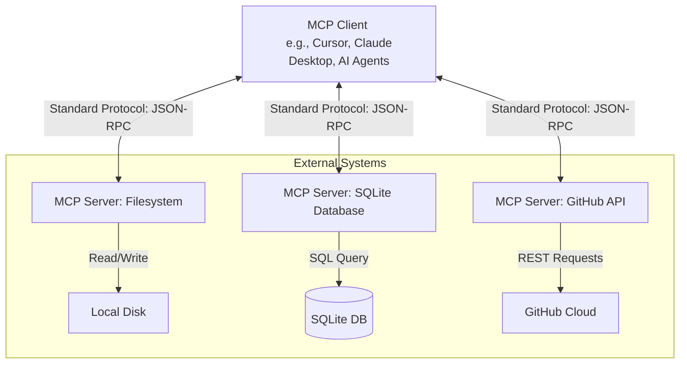

# Model Context Protocol (MCP): Standardizing LLM Integrations

Building AI applications and agents used to require writing custom integrations for every data source and tool. If you wanted an LLM to read a Postgres database, edit a file on your local machine, and post to Slack, you had to write custom API wrappers for all three.

The **Model Context Protocol (MCP)**, introduced by Anthropic, solves this fragmentation. It is an open standard that acts as a universal adapter between AI models and the tools or data sources they need to interact with.

Think of MCP as the **USB-C port for AI models**. Instead of building custom connections for every device, you connect everything through a single standardized protocol.

---

## 1. The MCP Architecture

MCP divides the integration layer into three distinct components:



1.  **MCP Host/Client:** The AI application or developer workspace (like Claude Desktop, Cursor IDE, or an agent framework) that interacts with the LLM. The client coordinates authentication, orchestrates tool execution, and manages context.
2.  **MCP Server:** A lightweight service that exposes specific capabilities (tools, resources, or prompts) through the standardized MCP interface. A server does not need to know which LLM is querying it.
3.  **Data Sources & Tools:** The underlying systems the server connects to, such as local files, databases, APIs, or web browsers.

---

## 2. The Three Pillars of MCP

The protocol standardizes communication into three main capabilities:

### A. Resources (Data Exposure)
Resources are a standardized way for servers to expose read-only data to the LLM. This could include database schemas, logs, local file contents, or API documentations.
*   *Example:* An MCP server exposes a resource URL like `postgres://prod-db/schema` so the LLM can inspect table columns before generating queries.

### B. Prompts (Templates)
Prompts allow servers to expose predefined system instructions or templates to the client. This helps standardize instructions for common workflows.
*   *Example:* A Git MCP server might expose a prompt template called `explain-commit` that includes instructions on how to analyze git diffs.

### C. Tools (Executable Actions)
Tools are functions that the LLM can request to execute to perform real-world actions. The client executes these tools on the user's behalf and returns the results to the model.
*   *Example:* A filesystem server exposes a tool `write_file(path, content)` allowing the LLM to write code directly to a file.

---

## 3. Communication Protocol (JSON-RPC)

Under the hood, MCP clients and servers communicate using **JSON-RPC 2.0** over two main transports:
*   **Stdio (Standard Input/Output):** Typically used for local servers running on the same machine as the client.
*   **SSE (Server-Sent Events) / HTTP:** Used for remote servers running over networks or in cloud sandboxes.

An example request from a client to run a tool:
```json
{
  "jsonrpc": "2.0",
  "method": "tools/call",
  "params": {
    "name": "read_file",
    "arguments": {
      "path": "/project/src/main.py"
    }
  },
  "id": 1
}
```

---

## 4. Why MCP is a Game Changer

*   **Reusability:** Once you write an MCP server (e.g., for querying your company's CRM), any MCP-compliant client (like Cursor, Claude, or a custom terminal agent) can use it instantly.
*   **Security & Sandboxing:** Because the server runs as a separate process or service, you can isolate it. The client can enforce permissions, asking the user for approval before running modifying tools.
*   **No Model Lock-in:** The protocol is model-agnostic. Whether you use Claude, GPT-4, or a local Llama model, the interface to your tools and databases remains exactly the same.

---

## 5. Quick Quiz

> [!IMPORTANT]
> **Question:** What is the primary role of the Model Context Protocol (MCP)?
> 
> *   **A)** To train smaller LLMs more efficiently
> *   **B)** To standardize the connection between LLMs and external tools, data sources, and services
> *   **C)** To encrypt prompt data in transit
> *   **D)** To translate models between different natural languages

### Correct Answer: **B) To standardize the connection between LLMs and external tools, data sources, and services**

**Explanation:**
Historically, every AI platform created its own proprietary way of calling tools and fetching files. MCP introduces a universal protocol standard (using JSON-RPC 2.0) that separates the LLM client application from the tool server implementation, enabling modular, reusable, and secure integrations.
