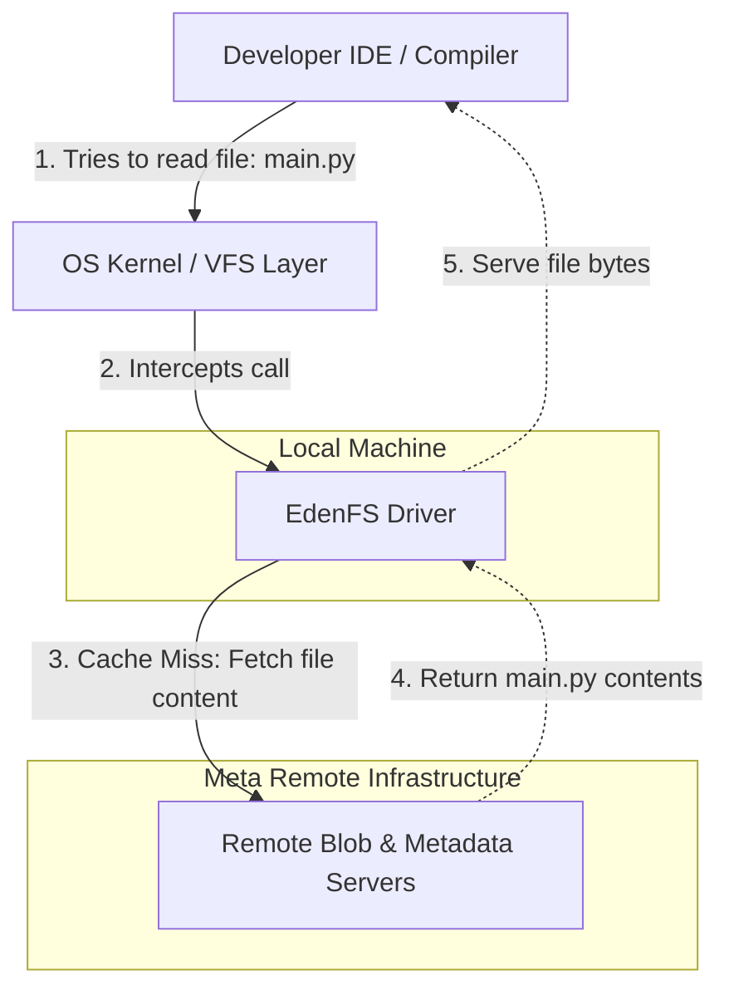

# Scaling Monorepos: How Meta Scaled Version Control Beyond Git

Many tech giants, including Meta (Facebook) and Google, prefer a **Monorepo** architecture—storing almost all of the company's code in a single, massive repository. 

A monorepo simplifies dependency management, makes code sharing trivial, and enables atomic commits across multiple projects. 

However, as a codebase grows to millions of commits and tens of millions of files, traditional version control systems like Git completely break down. 

Here is the deep dive into why Git failed at Meta, how they transitioned to Mercurial and built **Sapling**, and how they solved the storage problem using virtual file systems (**EdenFS**).

---

## 1. Why Git Collapses at Scale

Git was designed for distributed development (like the Linux kernel), where every developer clones a full copy of the repository history onto their local machine. At Meta's scale, this model hit critical bottlenecks:

### A. The `git status` Freeze
Every time you run `git status`, Git must scan the entire working directory to compare the timestamps and cryptographic hashes of every file against its index. With millions of files, a simple status check takes minutes, freezing developer IDEs.

### B. The Cloning Bottleneck
Cloning a multi-terabyte repository containing decades of history is mathematically and physically impossible on a standard developer laptop. The download would take days, and the local drive would run out of space.

### C. Sharding is Not Feasible
Some suggested "sharding" the monorepo—splitting it into hundreds of smaller, project-specific micro-repositories. However, Meta rejected this because it would break atomic cross-project updates, complicate dependency synchronization, and destroy the developer workflow of unified code search and reuse.

---

## 2. The Move to Mercurial and Sapling

Realizing Git could not scale, Meta looked for alternatives. They found **Mercurial (`hg`)**, which possessed a more modular, extensible architecture. 

1.  **Forking Mercurial:** Meta forked Mercurial and began rewriting its bottlenecks. They wrote a custom C++ extension to replace python-based file-checking loops and built server-side scaling index mechanisms.
2.  **Developing Sapling:** Over time, these modifications evolved into a brand new, open-source version control system called **Sapling**. Sapling retains Git-like commands and usability, but its architecture is fundamentally designed to handle scale by lazy-loading metadata.

---

## 3. EdenFS: The Virtual File System Solution

Even with Sapling, downloading millions of files during a checkout is a bottleneck. To solve this, Meta built **EdenFS** (Eden File System), a virtual file system that intercepts OS-level file operations.

### How EdenFS Works
Instead of performing a physical clone or checkout, EdenFS creates a **virtual clone**:
1.  **Instant Clones:** When you checkout a branch, EdenFS creates a hollow directory tree using filesystem hooks (FUSE). The files appear to exist in your file manager, but they occupy 0 bytes of disk space.
2.  **On-Demand Fetching:** When your IDE, compiler, or a terminal command tries to read a file (calling `open()` or `read()`), EdenFS intercepts the request at the OS kernel level.
3.  **Lazy Loading:** It instantly fetches the file's contents from Meta's remote servers in milliseconds, caches it locally, and serves the bytes to the application.
4.  **No Waste:** Developers only download the 1-2% of files they actually edit or compile, keeping disk usage low and checkouts instant.

---

## 4. Architectural Summary

| Challenge | Impact on Git | Meta's Scaled Solution (Sapling + EdenFS) |
| :--- | :--- | :--- |
| **Large Working Directory** | Slow `git status` (scans all files). | **Sapling** only tracks modified files and delegates file state checks to the filesystem. |
| **Gigantic History Size** | Cloning takes hours/days; disk fills up. | **Virtual Cloning** with metadata-only downloads. |
| **Downloading Files** | Network congestion during checkouts. | **EdenFS** virtualizes the files, loading them on-demand when accessed. |

---

## 5. Quick Quiz

> [!IMPORTANT]
> **Question:** What is the primary function of EdenFS in Meta's developer workflow?
> 
> *   **A)** To compress files into a local ZIP archive before compiling
> *   **B)** To split the giant monorepo into 500 smaller repositories
> *   **C)** To virtualize the local workspace directory, fetching file contents from remote servers only when they are opened or read
> *   **D)** To encrypt source code files on developers' laptops

### Correct Answer: **C) To virtualize the local workspace directory, fetching file contents from remote servers only when they are opened or read**

**Explanation:**
EdenFS acts as a virtual file system. When a developer clones a repository, no file data is initially downloaded. Instead, EdenFS populates the directory with virtual placeholders and retrieves the actual file contents over the network on-the-fly only when a tool (like a compiler or text editor) reads from the file.
