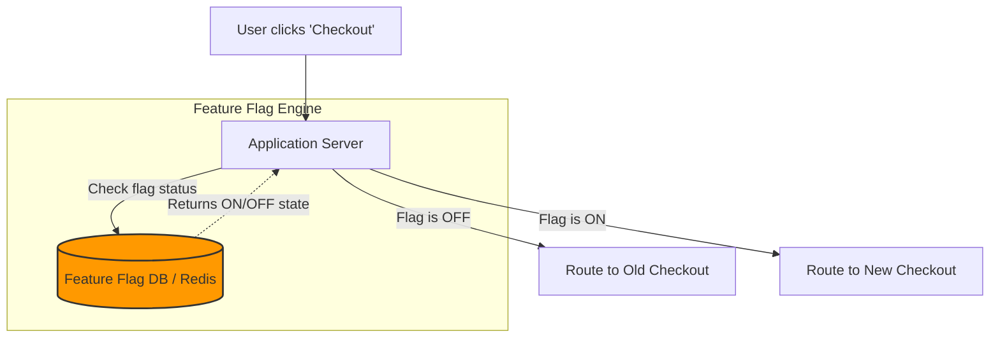
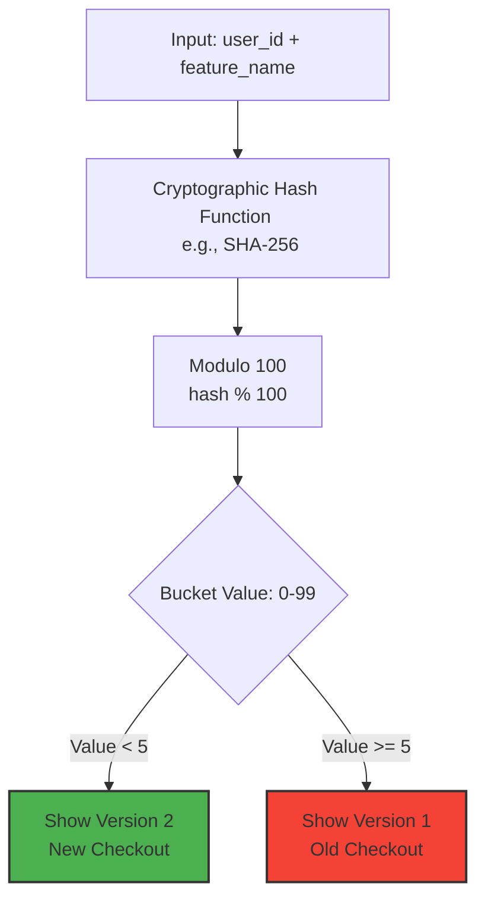

# Feature Flags & Deterministic Bucketing: Safe Deployments at Scale

Imagine you are deploying a brand new checkout page for a massive e-commerce website. 

Your goals are strict:
1. **Gradual Rollout:** Only show the new checkout to exactly **5% of users** initially to test for conversion rate drops.
2. **Instant Rollback:** If the new checkout contains a critical bug and payments start failing, you must revert to the old checkout instantly—in milliseconds.

How do you architect this without causing massive downtime or lengthy deployment cycles?

---

## The Bad Way: Deployment-Based Rollbacks

The traditional approach involves releasing the "Version 2" code to production servers. If a critical bug is discovered, the DevOps team must halt the rollout, trigger a CI/CD rollback pipeline, and deploy the "Version 1" code back to all servers.

**The Problem:**
*   Rolling back a deployment takes time (minutes to hours). During a checkout outage, every minute costs thousands of dollars.
*   Following strict DevOps deployment steps during an active incident causes stress and risks secondary human errors.
*   Targeting exactly 5% of users via load balancers is clunky and can break user sessions.

---

## The Modern Solution: Feature Flags

Instead of managing versions via deployments, both the old code and the new code live in production simultaneously. We control which code runs using a **Feature Flag** (or Feature Toggle).

A feature flag is simply a conditional statement in your code backed by a fast datastore (like Redis, LaunchDarkly, or a custom DB table).

```javascript
// The code ships with both checkout flows
if (FeatureFlagService.isEnabled('new_checkout_page', user)) {
    return renderNewCheckoutPage();
} else {
    return renderOldCheckoutPage();
}
```

### The Architecture



**Why this is powerful:** If the new checkout page crashes, a product manager can simply click a toggle in an admin dashboard to turn the flag `OFF`. The database updates instantly, and the very next user request hits the old, safe code path. **Zero deployment required.**

---

## The 5% Rollout Challenge: Deterministic Bucketing

If we want to roll out the new checkout page to exactly 5% of users, a naive approach might be to generate a random number:

```javascript
// BAD APPROACH: DO NOT DO THIS
const randomNum = Math.random() * 100;
if (randomNum < 5) {
    showNewCheckout();
}
```

**The Flaw with `Math.random()`:** It evaluates on every single request. If a user lands on the new checkout page, accidentally refreshes their browser, the random number regenerates, and they are suddenly thrown back to the old checkout page. This creates a confusing, broken user experience ("flickering").

### The Solution: Hash-Based Bucketing

To fix this, we need a method that is random across the whole population, but **consistent for an individual user**. We achieve this using **Deterministic Bucketing**.

We combine the `user_id` and the feature flag name, pass it through a cryptographic hash function (like MD5 or SHA-256), and take the modulo 100 to assign the user to a "bucket" between 0 and 99.



### Why Deterministic Bucketing is Brilliant:
1.  **Consistent Experience:** Because the hash function is deterministic, `user_123` will *always* hash to bucket `42`. If the rollout is at 5%, bucket 42 gets the old page. Even if they refresh 1,000 times, they stay in bucket 42.
2.  **Stateless:** We do not need to save "User 123 saw Version 2" in a database. The hash calculates instantly in memory, saving massive database overhead.
3.  **Smooth Gradual Rollouts:** If we increase the rollout from 5% to 10%, buckets 0-4 keep seeing the new page, and buckets 5-9 join them. No user gets downgraded.

---

## Quick Quiz

> [!IMPORTANT]
> **Question:** When rolling a feature out to 10% of users, why is deterministic hash-bucketing preferred over using a random number generator?
> 
> *   **A)** Hashing executes faster than a random number generator on modern CPUs.
> *   **B)** A random number generator will cause the UI to flicker and change versions if the user refreshes the page, whereas a hash guarantees a consistent experience per user.
> *   **C)** Hashing uses less memory in the database.
> *   **D)** A random number generator cannot accurately hit 10% distribution across large datasets.

### Correct Answer: **B**

**Explanation:** A random number evaluates uniquely on every page load. If you use it, a user might see the new UI, refresh the page, and get the old UI. Deterministic bucketing hashes the user's ID, ensuring that a specific user always falls into the exact same bucket and receives a consistent experience across all devices and sessions.
