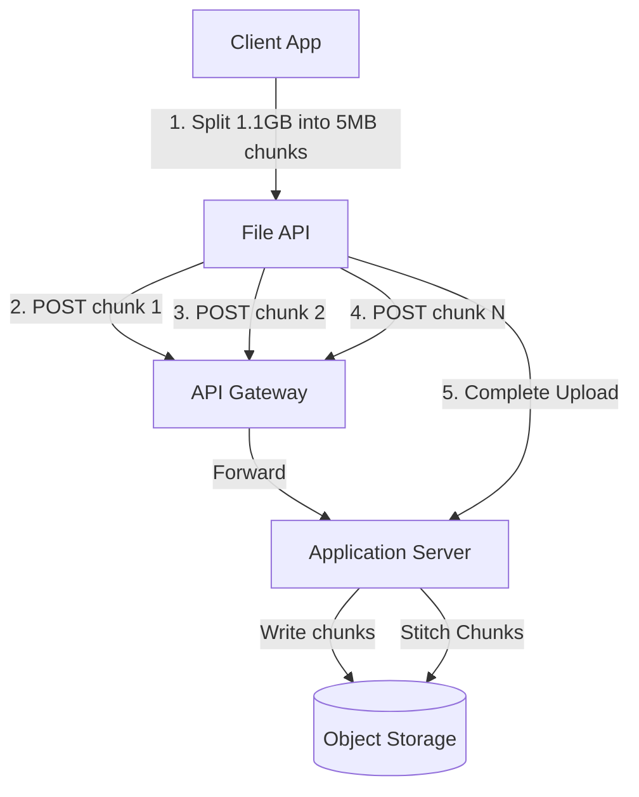
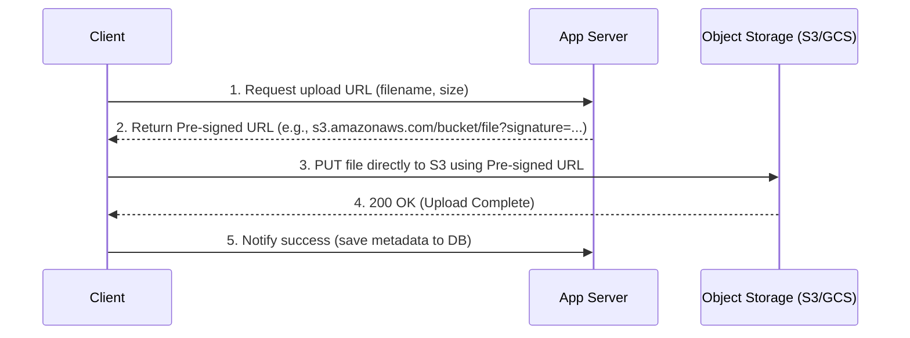

# Designing Large File Uploads: Fixing 504 Timeouts and 400 Bad Requests

Uploading massive files (e.g., a **1.1GB** ZIP file containing satellite data or "EOS extraction tiles") is a common requirement in modern software systems. 

However, naively sending large files via standard HTTP requests often leads to failure, resulting in two classic errors:
1.  **Connection failed with status 504 (Gateway Timeout):** The upload takes so long that the API Gateway or Load Balancer drops the connection.
2.  **AxiosError: Request failed with status code 400 (or 413 Payload Too Large):** The web server or application framework rejects the request because it exceeds maximum payload size limits.

Here is the system design analysis of why these errors happen and how to build a scalable, reliable file upload system.

---

## 1. Why Large Uploads Fail

### A. The 504 Gateway Timeout
Most production architectures route client traffic through an API Gateway or Load Balancer (e.g., Nginx, AWS ALB, Cloudflare) before it reaches the backend.
*   **Default Timeouts:** These gateways have default timeout limits (typically 30 to 60 seconds).
*   **The Issue:** Uploading 1.1GB on an average internet connection can take several minutes. Once the gateway's timeout limit is exceeded, it terminates the connection and returns a `504 Gateway Timeout` to the client.

### B. The 400 / 413 Bad Request
Web servers and application frameworks implement guardrails to prevent Denial of Service (DoS) attacks by limiting request body sizes.
*   **Nginx default:** `client_max_body_size` is set to **1MB** by default.
*   **Node.js / Express default:** Body parser limits are typically **100KB** to **50MB**.
*   **The Issue:** Attempting to send a 1.1GB payload in a single HTTP request triggers an immediate rejection from the server with a `413 Payload Too Large` or `400 Bad Request` error.

### C. Network Instability
If a user is 90% through a 1.1GB upload and their Wi-Fi momentarily drops, a single-stream HTTP upload will fail completely. The user has to restart the entire upload from 0%.

---

## 2. Production-Grade Solutions

To scale uploads reliably, we must bypass the application server and break the files into smaller pieces.

### Solution A: Chunked (Multipart) Uploads
Instead of uploading the file as a single stream, the client-side JavaScript breaks the file into small, fixed-size chunks (e.g., 5MB to 10MB each) and uploads them sequentially or in parallel.



#### How it works:
1.  **Initiate:** The client notifies the backend: *"I want to upload file `data.zip` (1.1GB)"*. The storage provider (like AWS S3) returns a unique `UploadId`.
2.  **Upload Chunks:** The client uploads each 5MB chunk individually with the `UploadId` and a `PartNumber`.
3.  **Complete:** Once all chunks are uploaded, the client sends a complete request. The storage provider stitches the parts back into a single 1.1GB file.

#### Why this fixes the errors:
*   **No 504 Timeouts:** Each 5MB chunk takes only a few seconds to upload, never hitting the 30-second gateway timeout.
*   **No 400/413 Limits:** Individual requests are tiny (5MB), well below server body limits.
*   **Resumability:** If chunk #89 fails due to a network drop, the client only retries that specific 5MB chunk instead of restarting the entire 1.1GB upload.

---

### Solution B: Direct-to-Storage (Pre-signed URLs)
Routing binary file streams through your application server wastes CPU cycles, consumes memory, and blocks application threads. The application server should only handle metadata.



#### How it works:
1.  **Request URL:** The client asks the backend for permission to upload.
2.  **Generate Signature:** The backend generates a temporary, cryptographically signed URL (Pre-signed URL) pointing directly to an Object Storage bucket (e.g., AWS S3 or Google Cloud Storage).
3.  **Direct Upload:** The client uploads the file directly to the storage bucket using this URL.
4.  **Callback:** Once the upload is complete, the client notifies the backend to update the database records.

---

## 3. Quick/Naive Fixes (Config Tuning)

If you cannot refactor the application to use Multipart or Direct Uploads immediately, you can temporarily mitigate the issue by increasing server and gateway limits:

### 1. Increase Gateway Timeouts (Nginx)
Increase the timeouts in your Nginx configuration:
```nginx
proxy_read_timeout 600s;
proxy_connect_timeout 600s;
proxy_send_timeout 600s;
```

### 2. Increase Request Size Limits
*   **Nginx Configuration:**
    ```nginx
    client_max_body_size 2G; # Allow up to 2GB uploads
    ```
*   **Node.js / Express Body Parser:**
    ```javascript
    app.use(express.json({ limit: '2gb' }));
    app.use(express.urlencoded({ limit: '2gb', extended: true }));
    ```

---

## 4. Quick Quiz

> [!IMPORTANT]
> **Question:** Why does uploading a 1.1GB file directly through a standard API gateway gateway timeout (504), and how does Multipart Upload resolve it?
> 
> *   **A)** Large files fragment the network packets; Multipart Upload compresses the packets into a single ZIP.
> *   **B)** Gateway timeouts are caused by file corruption; Multipart Upload verifies hashes at the end.
> *   **C)** Gateways drop connections that take longer than 30-60 seconds; Multipart Upload breaks the file into tiny chunks that upload in seconds, avoiding the timeout.
> *   **D)** Gateways cannot route requests without a query string; Multipart Upload adds query strings to each file block.

### Correct Answer: **C) Gateways drop connections that take longer than 30-60 seconds; Multipart Upload breaks the file into tiny chunks that upload in seconds, avoiding the timeout.**
