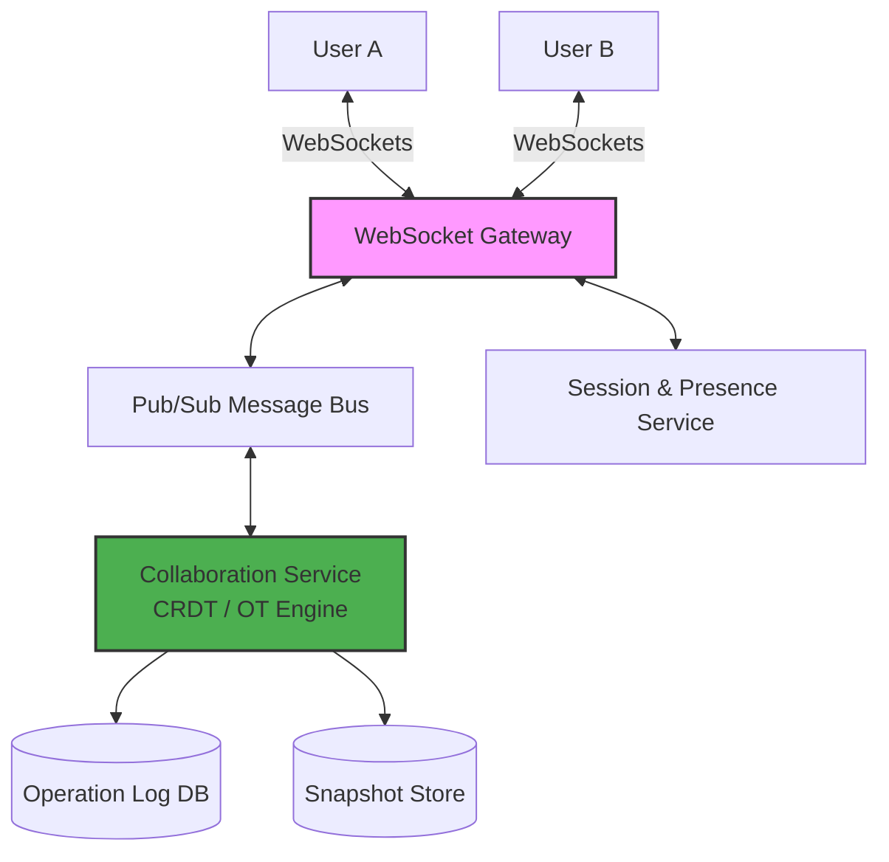

# Engineering Real-Time Collaborative Systems: A Technical Briefing

# Executive Summary

The design of real-time collaborative document editors, exemplified by systems like Google Docs, represents a shift from traditional CRUD (Create, Read, Update, Delete) applications to complex distributed state machines. These systems must resolve concurrent edits from thousands of users while maintaining a "single authority" for document state under conditions of network latency and offline editing.**Critical Takeaways:**

* **Operations over State:**  Documents are not stored as strings but as immutable, append-only logs of operations (keystrokes). This enables conflict-free merging and full version history.  
* **Concurrency Control Evolution:**  Modern systems are transitioning from Operational Transformation (OT)—which requires a central server to serialize and transform operations—to Conflict-free Replicated Data Types (CRDTs), which allow for deterministic merging across distributed nodes without a central "brain."  
* **The Three-Layer Storage Model:**  Reliability is achieved by separating concerns into Transactional Metadata (permissions/titles), Event Logs (every keystroke), and State Snapshots (periodic document captures for fast loading).  
* **Global Networking Fabric:**  To achieve sub-120ms latency, systems utilize geo-aware DNS, WebSocket gateways for connection concentration, and deterministic document routing to shard-specific realtime servers.

## High-Level Architecture

# 1\. System Requirements and Scale Estimation
## Functional and Non-Functional Requirements

| Category | Target Metric / Feature |
| ----- | ----- |
| **Latency** | \< 120 ms P95 (for responsiveness) |
| **Availability** | 99.99% |
| **Durability** | "11 nines" (no data loss) |
| **Concurrency** | 100+ simultaneous editors per document |
| **Consistency** | Eventual consistency for views; Strong consistency for storage |
| **Scalability** | 1B+ documents; 200M+ daily active users |
| **Core Functions** | Rich-text editing, cursor tracking, offline sync, version history, and RBAC (Role-Based Access Control) |

## The Scale Challenge

With 10M concurrent editors and an average of 500 edits per user daily, the system must handle peak write throughput of approximately 10M writes per second. Traditional database architectures fail here because every keystroke is a write operation, and "last-write-wins" strategies would result in massive data loss during concurrent edits.

# 2\. Core Architectural Principles: Operations as the Source of Truth

The fundamental innovation in collaborative editing is the treatment of a document as a sequence of operations rather than a static text blob.

* **Operation Structure:**  A single keystroke is a structured object containing:  
* **Who:**  User ID.  
* **What:**  The change (e.g., insert 'A').  
* **Where:**  Character position or unique ID.  
* **Context:**  What other changes this edit depends on.  
* **Document Reconstitution:**  To display a document, the system starts with an empty state and applies the append-only log of operations in order.  
* **Scaling via Operations:**  Operations are tiny (tens of bytes) and immutable, making them easy to transmit and merge across global networks compared to large text files.

# 3\. Concurrency Control: OT vs. CRDT

Handling simultaneous edits is the most difficult aspect of the design. Two primary methodologies exist:

## Operational Transformation (OT)

OT was the original solution for Google Docs. It relies on a central server to decide a global order for operations. This dependence on a central authority to maintain consistency introduces significant bottlenecks; scaling OT for multi-region, distributed networks is notoriously difficult as the central "brain" must reconcile global state in real-time, often leading to increased latency and complex synchronization logic.

* **Mechanism:**  If two users edit position 5 simultaneously, the server transforms the second operation's position to 6 to account for the first insertion.  
* **Weakness:**  OT is notoriously difficult to implement for offline users or multi-region systems because it assumes a "single brain" timeline. If history is missing or arrives out of order, the transformation breaks.

## Conflict-free Replicated Data Types (CRDT)

CRDTs design operations so that conflicts are mathematically impossible. They are broadly categorized into two types: operation-based CRDTs, which propagate only the specific changes (mutations) to other nodes, and state-based CRDTs, where the entire full state of the object is sent and merged. Because CRDTs possess commutative and associative mathematical properties, they are generally considered superior for offline-first, decentralized systems; these properties ensure that regardless of the order in which edits are received or merged, all nodes eventually arrive at the same identical state without requiring a central authority.

* **Mechanism:**  Every character is assigned a unique, immutable ID (e.g., a ID between 10 and 20 might be 15).  
* **Advantages:**  
* **Commutative:**  The order of message arrival does not matter.  
* **Offline-First:**  Users can edit offline for days; when they reconnect, the IDs ensure their edits slot into the correct place without a central server's "permission."  
* **P2P Friendly:**  Supports true peer-to-peer collaboration without a central authority.

## The Jupiter Family of Protocols

The "Jupiter" family represents different implementations of these concepts:

* **AbsJupiter:**  An abstract, implementation-independent protocol using mathematical sets.  
* **AJupiter:**  Uses a 1D buffer for non-context-based operations.  
* **CJupiter/XJupiter:**  Utilize n-ary or 2D digraphs (edge-labeled directed graphs) to guide transformations and maintain state.

# 4\. Networking and Global Connection Fabric

Standard HTTP requests are insufficient for real-time collaboration due to overhead and latency. Instead, these systems use  **WebSockets over TCP** .

## The Connection Pipeline

1. **Geo-aware DNS:**  Routes the user to the nearest data center based on Latency Probes and GeoIP.  
2. **WebSocket Gateways:**  These "Connection Concentrators" terminate millions of TCP sockets, offload TLS, and provide DDoS protection. They are stateless routers that shield the application servers.  
3. **Deterministic Doc Routing:**  Gateways read the docId and route all users editing that specific document to the same  **Realtime Collaboration Server** . This avoids the need for distributed locks.  
4. **In-Memory State:**  The Collaboration Server keeps the document's full CRDT state in RAM to allow for microsecond updates and instant "fan-out" (broadcasting one user's keystroke to 100 others).

# 5\. Storage and Persistence Architecture

| Layer | Technology Example | Data Type | Purpose |
| ----- | ----- | ----- | ----- |
| **Metadata Store** | PostgreSQL / Spanner | Permissions, titles, owners | Transactional, strongly consistent security. |
| **Operation Log** | Kafka | Every single CRDT operation | The "Source of Truth"; append-only, write-ahead log. |
| **Snapshot Store** | S3 / GCS | Periodic CRDT state | Fast document loading; avoids replaying millions of ops. |

## The Write-Ahead Log (WAL)

Before a server acknowledges a successful edit to the user, the operation is appended to the  **Event Log (Kafka)** . If a server crashes, the document is rebuilt by loading the last snapshot from S3 and replaying the remaining operations from the Kafka log.

# 6\. Frontend and Offline Synchronization

The browser in a collaborative system acts more like a  **distributed database node**  than a simple UI.

* **Local Persistence:**  Edits are first written to  **IndexedDB**  (a local write-ahead log). This ensures that if the tab crashes or the laptop loses power, no data is lost.  
* **The Sync Engine:**  
* **Online:**  Sends local operations and receives remote ones via WebSockets.  
* **Offline:**  Continues to generate and store operations locally with a sentToServer \= false flag.  
* **Reconnection:**  Performs a two-phase sync where local logs are pushed to the server and the server's newer operations are merged into the local CRDT state.

# 7\. Security and Presence

## Metadata vs. Content

Security (permissions) must be  **strongly consistent** . If a user's access is revoked, they must lose access immediately. Consequently, permissions are stored in a transactional database (like Spanner) and enforced at the Gateway/Server level, rather than being embedded in the eventually consistent CRDT.

## Real-time Streams

Collaborative systems manage three independent streams to optimize bandwidth:

1. **Edits:**  High durability, stored in Kafka.  
2. **Cursors:**  Ephemeral, stored only in memory. High-frequency updates (caret position, selection) are broadcast to others but never saved to disk.  
3. **Presence:**  Heartbeat-based online/offline status; auto-expires if the connection drops.

# Conclusion

Building a system of this complexity requires moving away from the "database as truth" model to a "log as truth" model. By combining  **CRDTs**  for conflict-free merging,  **WebSockets**  for low-latency communication, and a  **multi-tiered storage strategy** , these platforms achieve the "magic" of seamless, global collaboration. The ultimate goal is to ensure that even if a network partition occurs or a data center fails, the document remains consistent and durable.

## Takeaway 1: Your Document is a "Log," Not a String

To a casual user, a document is a collection of characters. To the backend, that's a "naive" and dangerous assumption. If Google Docs used standard CRUD (Create, Read, Update, Delete) to send the entire text string every time you typed a character, the bandwidth would explode and data loss would be guaranteed as users overwrote each other.  
Instead, the system utilizes **Event Sourcing**. Your document is never stored as a final string in the "hot path"; it is a sequence of immutable "operations."  
*"Each keystroke becomes a small operation... Instead of storing text, we store the history of changes."*  
When you type, your browser generates a tiny intent, like `Insert("A", 12)`. This is the only way to support infinite undo/redo and complex version history at scale. To show you the current state, the system simply "replays" the log.

## Takeaway 2: The Great Concurrency Battle: OT vs. CRDT

The hardest problem in distributed systems is reaching a "Single Version of the Truth" when users edit the same spot simultaneously.  
Historically, Google Docs was built on **Operational Transformation (OT)**, specifically the "Jupiter" family of protocols. OT requires a "central brain"—a stateful server—to receive operations, transform their positions based on other concurrent edits, and broadcast them back. It’s effective but high-maintenance; if the server loses the transformation history or a user goes offline for too long, the document can "fork."  
Modern requirements for "offline-first" and mobile workflows have pushed the architecture toward **Conflict-free Replicated Data Types (CRDTs)**. In a CRDT model, we stop tracking character positions and instead give every character a globally unique ID. This allows changes to be merged "conflict-free" without a central authority deciding the order.

| Feature | OT | CRDT |
| ----- | ----- | ----- |
| **Server** | Centralized | Decentralized |
| **Offline** | Limited | Excellent |
| **Implementation** | Complex | Moderate |

## Takeaway 3: The 120ms Rule: Why HTTP Just Doesn't Cut It

In real-time collaboration, the target is a **P95 latency of \< 120ms**. Traditional REST APIs are too heavy for this. They are "pull-based," meaning the server can't push your colleague’s keystroke to you instantly.  
Google Docs relies on **WebSockets over TCP** to create a bidirectional, low-latency stream. The architecture uses **WebSocket Gateways** (Connection Concentrators) to handle TCP termination, TLS offloading, and backpressure.  
To shave off the final milliseconds, the system uses **Geo-aware DNS**. This routes you to the nearest data center based on latency probes. The system also solves the **"Fan-out" problem**: a single keystroke must be broadcast to 100+ other editors instantly.

## Takeaway 4: Why Databases are Too Slow for Your Keystrokes

Standard databases cannot handle 10 million writes per second with sub-millisecond response times. Instead, systems use **Stateful Servers** that keep the document state entirely in **RAM**.  
*"The networking layer is more important than the database."*  
While live editing happens in memory, durability is handled by a **Write-Ahead Log (Kafka)**. Every keystroke is appended to this sequential log because append-only writes are significantly faster than updating a database index.  
The system splits storage into three distinct layers:

1. **Operation Log (Kafka):** For the "hot" stream of keystrokes.  
2. **Snapshot Store (S3):** Periodically saving the state for fast document loading.  
3. **Metadata Store (Spanner):** For strongly consistent data like file permissions.

## Takeaway 5: Your Browser is Secretly a Distributed Database Node

The frontend isn't just a UI; it's a node in a distributed system. To support offline sync, the browser uses **IndexedDB** as a local write-ahead log.  
The browser's **Sync Engine** performs a "two-phase sync." It generates a unique `opId` for every keystroke to detect and discard duplicate edits. The client handles the heavy lifting of merging logs, leaving the backend to act as a global coordinator.  
