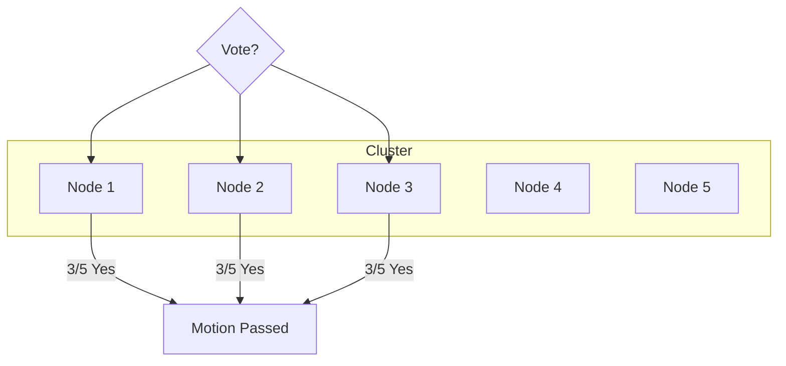
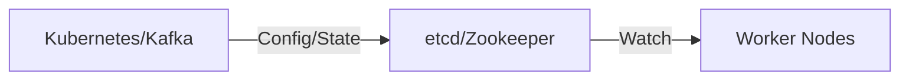

# Consensus & Coordination: Who's in Charge?

## Introduction: The "Angry Mob" Problem

When you have 100 servers working together, they need to agree on things. Who is the leader? Is the database up? Who gets to update the user's balance? 

Without a coordination system, your distributed system becomes an "Angry Mob" where every server tries to do its own thing, leading to data corruption and chaos.

---

## Part 1: Leader Election

In many systems, one node must be the "boss" (the Leader). But what happens if the leader crashes?

**Leader Election** is the process where the remaining servers vote for a new leader.
*   **The Challenge:** How do you ensure only *one* leader is elected?
*   **The Split-Brain Problem:** If the network splits in half, both halves might elect their own leader. Now you have two bosses giving conflicting orders. This is a disaster.

---

## Part 2: The Power of Quorum

How do we prevent "Split-Brain"? We use **Quorum**.

To make any major decision (like electing a leader or committing data), a "Majority" must agree. 
*   If you have 5 servers, the Quorum is 3.
*   If the network splits into 2 vs 3, only the side with 3 servers can make decisions. The side with 2 knows it doesn't have a majority and stays quiet.

---

## Part 3: Fencing & Majority Tokens

Even with a leader, network delays can cause "Zombies"—an old leader who thinks they are still in charge.

*   **Fencing Token:** Every time a new leader is elected, they get a higher "Token Number" (e.g., 101, 102).
*   **The Guard:** When the leader sends a command to the database, the database checks the token. If it sees a request from 101 but already accepted one from 102, it rejects 101's command.

---

## Part 4: The Librarians (Zookeeper & etcd)

Most developers don't write their own consensus algorithms from scratch. They use dedicated services:

*   **Apache Zookeeper:** The "Grandfather" of coordination. Used by Kafka and Hadoop to manage cluster state.
*   **etcd:** A modern, distributed key-value store. This is the "brain" of Kubernetes, storing every single piece of configuration for your containers.

---

## Revision Summary

| Topic | Key Concept | Why it matters |
| :--- | :--- | :--- |
| **Leader Election** | Voting for a "Boss" node | Avoids chaos; ensures one source of truth |
| **Quorum** | Majority rule (N/2 + 1) | Prevents "Split-Brain" during network failures |
| **Fencing** | Sequential tokens | Stops "Zombie" leaders from doing damage |
| **Coordination** | Zookeeper / etcd | Reliable shared storage for system configuration |

## Conclusion

Coordination is the "glue" that holds distributed systems together. By using Quorum and tools like etcd/Zookeeper, we transform a collection of unreliable machines into a single, reliable unit.
