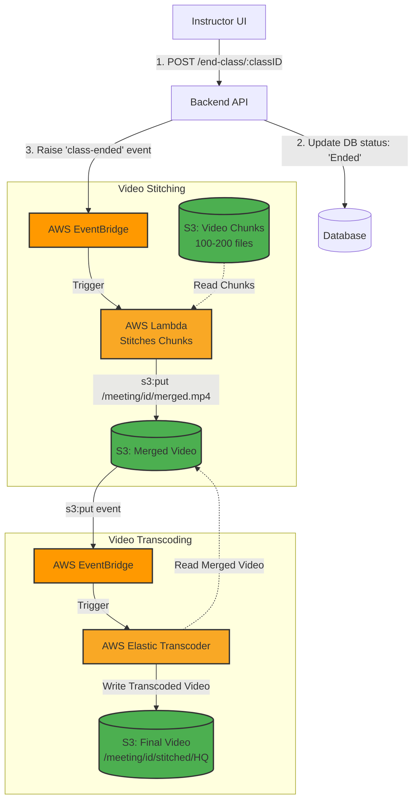

# System Design: Video Transcoding System (Live to VOD)

When an online live class ends, students often expect the recording to be available almost immediately. However, processing a 2.5-hour video file is a heavy task. If the system waits until the class is over to upload a massive video file, it will be slow, prone to network failures, and delay the availability of the recording. 

This article outlines an **Event-Driven Video Transcoding Architecture** that solves this problem by uploading video in chunks and stitching them together asynchronously using AWS serverless technologies.

---

## 1. The Core Strategy: Chunking

Instead of recording one giant video file locally on the instructor's device, the client application records the live class in small segments (e.g., 1-minute chunks). 
* Over a 2.5-hour class, this results in **100 to 200 chunks**.
* These chunks are uploaded to an **AWS S3 Bucket** continuously in the background while the live class is still ongoing.

This approach guarantees that when the instructor clicks "End Class", 99% of the video data is already safely stored in the cloud.

---

## 2. Step-by-Step Architecture Flow

When the class concludes, an event-driven pipeline takes over to process the chunks into a final video.

### Step 1: End Class Trigger
The instructor clicks "End Class". The client sends a request to the backend:
`POST /end-class/:classID`

The database updates the class status to `'Ended'`.

### Step 2: Raising the Event
The backend service raises a `class-ended` event. This event is sent to **AWS EventBridge**, a serverless event bus used to connect application components together, enabling a highly scalable event-driven application.

### Step 3: Stitching with AWS Lambda
EventBridge routes the `class-ended` event to an **AWS Lambda** function. 
* The Lambda function's job is to read the specific folder in S3 containing the 100-200 chunks for this `classID`.
* It merges (stitches) all these small files together into one continuous, raw video file.
* It uploads this merged file back to S3 (e.g., `s3:put /meeting/{id}/merged.mp4`).

### Step 4: Transcoding
The `s3:put` action (the creation of the merged file) triggers another rule in EventBridge.
* EventBridge invokes **AWS Elastic Transcoder** (or AWS MediaConvert).
* The transcoder pulls the raw merged file and converts it into standard formats and resolutions (e.g., 1080p HQ, 720p, 480p) suitable for different devices and bandwidths.

### Step 5: Final Storage and Availability
The Elastic Transcoder outputs the final processed videos back to a destination S3 bucket (e.g., `/meeting/{id}/stitched/HQ.mp4`).
* A final event notifies the backend database that the video processing is complete.
* The UI updates for students, changing the status to **"Recording Available"**.

---

## 3. High-Level Architecture Diagram

### Why this architecture is powerful:
* **Fault Tolerance:** If stitching fails, the Lambda can simply retry without losing the raw chunks.
* **Serverless Scalability:** Using Lambda and EventBridge means the system scales automatically. If 500 classes end at exactly 5:00 PM, AWS spins up 500 Lambdas instantly to stitch the videos, with zero idle server costs.
* **Speed:** Because chunks are uploaded during the live class, the only latency after the class ends is the stitching and transcoding process.
