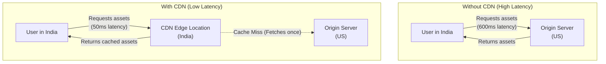
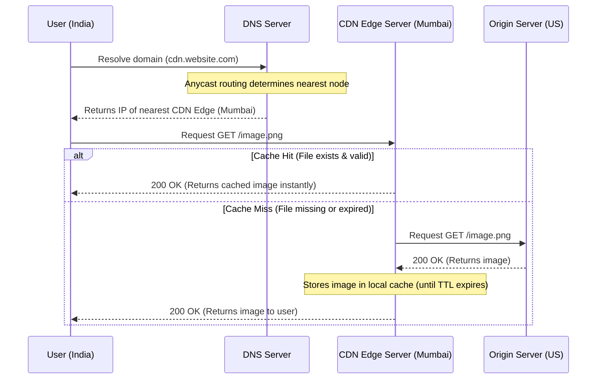

# Reducing Geographical Latency with Content Delivery Networks (CDN)

## The Problem

Imagine you have a website deployed with the following performance discrepancy:
- **Australia:** Page loads in **80 ms**.
- **India:** Page loads in **600 ms**.

Both users are accessing the exact same website, with the exact same backend, running the exact same code. 

### Why Does This Happen?
The root cause is **Network Latency** due to physical distance. If your main backend (origin server) is located in the US, data packets have to travel thousands of miles across oceanic fiber-optic cables and multiple network routers to reach a user in India. 

Every time the Indian user's browser requests heavy assets (like images, CSS, or JS), the request must travel all the way to the US and back, resulting in a slow page load time.

---

## The Solution: Content Delivery Network (CDN)

To fix this issue, you should use a **Content Delivery Network (CDN)**.

### What is a CDN?
A CDN is a geographically distributed group of servers (referred to as **Edge Locations** or Edge Servers) that work together to provide fast delivery of Internet content.

### How Does It Work?
1. **Caching Static Content:** A CDN is configured to store (cache) copies of your website's static assets. This includes files that don't change dynamically per user, such as:
   - Images (`.png`, `.jpg`, `.svg`)
   - Videos (`.mp4`, `.webm`)
   - Stylesheets (`.css`)
   - JavaScript files (`.js`)
   - HTML documents
2. **Global Distribution:** These edge locations are spread across data centers all over the world.
3. **Routing Requests:** When a user visits your website, the system automatically routes their request for static files to the CDN edge server that is geographically closest to them.

### Architecture Diagram

## Deep Dive: Technical Details of CDN Operation

Under the hood, a CDN relies on several networking and caching concepts to function efficiently:

### 1. DNS Resolution & Anycast Routing
How does the Indian user's browser know to talk to the Mumbai server instead of the US server? 
When the browser resolves the CDN's domain name (e.g., `cdn.yourwebsite.com`), the DNS uses **Anycast Routing** or Geo-DNS. 
- In Anycast, multiple edge servers around the world announce the exact same IP address.
- The Internet's core routing protocols (like BGP) automatically route the user's request to the node with the shortest topological network path, which perfectly correlates to the closest geographical server.

### 2. Cache Hits vs. Cache Misses
- **Cache Hit:** The requested file is already stored on the edge server. The server immediately returns it to the user. (Lightning fast).
- **Cache Miss:** The requested file is *not* on the edge server (either it's the first time it was requested, or the cache expired). The edge server acts as a proxy: it forwards the request to your **Origin Server** in the US, fetches the file, caches it locally for future users, and then returns it.

### 3. Cache Invalidation and TTL (Time-To-Live)
How does the CDN know when to update a file if you deploy a new version of a CSS file?
- **TTL (Time-To-Live):** Files are cached with an expiration time, controlled by HTTP headers sent from your origin server (e.g., `Cache-Control: max-age=3600` caches the file for 1 hour). Once the TTL expires, the next request triggers a Cache Miss to fetch the fresh version.
- **Cache Busting / Invalidation:** For immediate updates without waiting for TTL to expire, developers use file versioning in the URL (e.g., `style.v2.css`) or explicitly call the CDN's API to "purge" the stale cache.

### 4. Push CDN vs. Pull CDN
- **Pull CDN (Most Common):** The edge servers dynamically pull the content from your origin server only when a Cache Miss occurs. It is hands-off for developers.
- **Push CDN:** You explicitly upload your static assets directly to the CDN's storage ahead of time (often during a CI/CD build step). The CDN serves exactly what you pushed.

### Step-by-Step Request Lifecycle

Here is the exact sequence of events when a user requests a file (`image.png`) that is served via a CDN:

### The Impact
Instead of an Indian user fetching all the content all the way from the US origin server, they get it from a nearby edge location (e.g., a server in Mumbai or Delhi). 

Because the data has a much shorter distance to travel, the website experiences:
- **Much lower latency**
- **Faster page load speeds**
- **Reduced bandwidth and load on the origin backend**

By implementing a CDN, you achieve optimal performance globally with the exact same backend and codebase.
