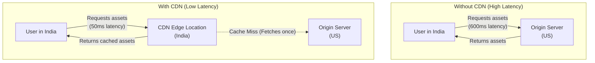

# Reducing Geographical Latency with Content Delivery Networks (CDN)

## The Problem

Imagine you have a website deployed with the following performance discrepancy:
- **Australia:** Page loads in **80 ms**.
- **India:** Page loads in **600 ms**.

Both users are accessing the exact same website, with the exact same backend, running the exact same code. 

### Why Does This Happen?
The root cause is **Network Latency** due to physical distance. If your main backend (origin server) is located in the US, data packets have to travel thousands of miles across oceanic fiber-optic cables and multiple network routers to reach a user in India. 

Every time the Indian user's browser requests heavy assets (like images, CSS, or JS), the request must travel all the way to the US and back, resulting in a slow page load time.

---

## The Solution: Content Delivery Network (CDN)

To fix this issue, you should use a **Content Delivery Network (CDN)**.

### What is a CDN?
A CDN is a geographically distributed group of servers (referred to as **Edge Locations** or Edge Servers) that work together to provide fast delivery of Internet content.

### How Does It Work?
1. **Caching Static Content:** A CDN is configured to store (cache) copies of your website's static assets. This includes files that don't change dynamically per user, such as:
   - Images (`.png`, `.jpg`, `.svg`)
   - Videos (`.mp4`, `.webm`)
   - Stylesheets (`.css`)
   - JavaScript files (`.js`)
   - HTML documents
2. **Global Distribution:** These edge locations are spread across data centers all over the world.
3. **Routing Requests:** When a user visits your website, the system automatically routes their request for static files to the CDN edge server that is geographically closest to them.

### Architecture Diagram

### The Impact
Instead of an Indian user fetching all the content all the way from the US origin server, they get it from a nearby edge location (e.g., a server in Mumbai or Delhi). 

Because the data has a much shorter distance to travel, the website experiences:
- **Much lower latency**
- **Faster page load speeds**
- **Reduced bandwidth and load on the origin backend**

By implementing a CDN, you achieve optimal performance globally with the exact same backend and codebase.
