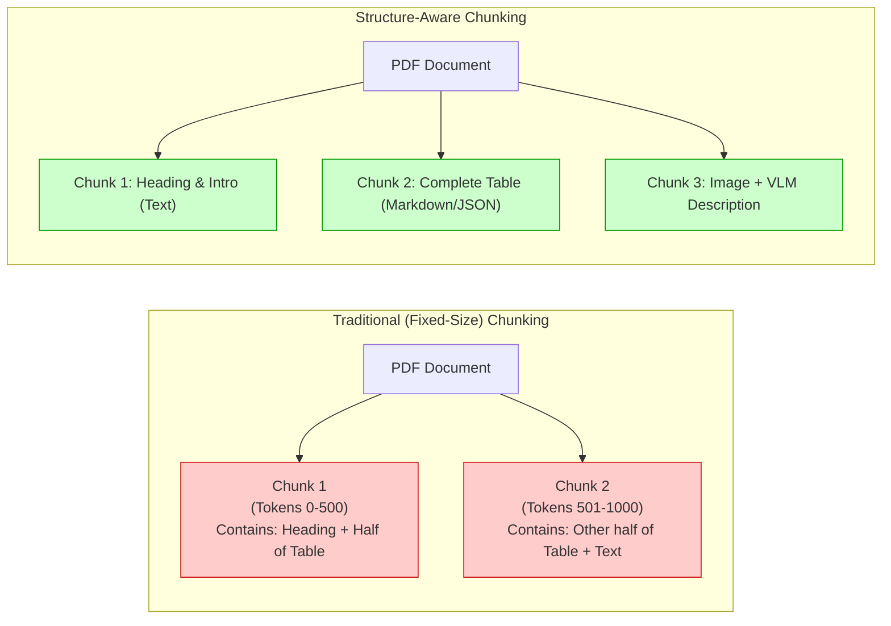
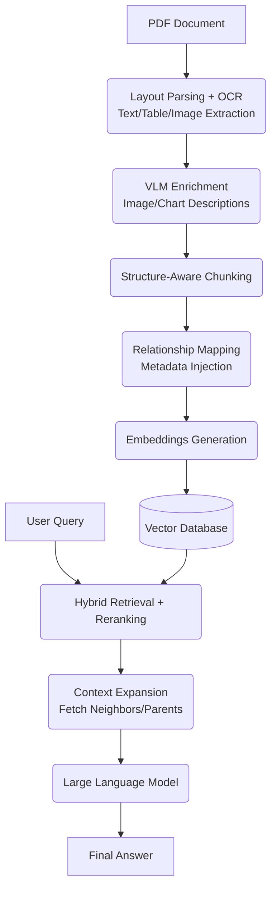

# Multimodal, Structure-Aware RAG Pipeline for PDFs

## The Problem with Traditional RAG on PDFs
When dealing with PDFs that contain tables, images, and text, treating the PDF as plain text and applying fixed-size chunking leads to a loss of critical relationships between these elements.

## The Solution
Instead of traditional plain-text extraction and fixed-size chunking, build a **multimodal, structure-aware RAG (Retrieval-Augmented Generation) pipeline**.

### 1. Layout-Aware Document Parsing
Extract headings, paragraphs, tables, images, and their positions accurately.
- **Tools/Libraries:** PyMuPDF, Docling, Unstructured, LlamaParse

### 2. OCR for Scanned Documents
For scanned PDFs and images, extract text while preserving layout information using Optical Character Recognition (OCR).
- **Tools/Models:** PaddleOCR, Tesseract, EasyOCR, Surya OCR

### 3. Table Extraction
Extract tables as structured formats (Markdown, HTML, or JSON) instead of flattening them into plain text. This preserves rows, columns, and tabular relationships.
- **Tools/Libraries:** Camelot, pdfplumber, Tabula, Docling

### 4. Image & Chart Understanding
Extract images, charts, and diagrams, and generate contextual descriptions for them using Vision Language Models (VLMs).
- **Models:** GPT-4o, Claude 3.5 Sonnet, Gemini 1.5 Pro, Qwen-VL

### 5. Structure-Aware Chunking
Instead of splitting text into arbitrary fixed-size chunks (e.g., 500 tokens), split the content based on its logical structure: headings, sections, tables, and semantic boundaries.
- **Tools/Libraries:** LangChain, LlamaIndex, Docling

### 6. Preserve Relationships
Store rich metadata to keep related text, tables, and images connected via parent-child relationships and neighboring chunk references.
Metadata to store:
- `page_number`
- `section`
- `element_type`
- `parent_id`
- `document_id`

### 7. Embeddings & Storage
Generate embeddings for the extracted and structured content and store them in a Vector Database.
- **Embedding Models:** BGE, E5, OpenAI Embeddings
- **Vector Databases:** Pinecone, Qdrant, Milvus, Chroma, FAISS

### 8. Retrieval & Context Expansion
Use hybrid search (combining keyword and vector search), reranking, and metadata filtering to retrieve the most relevant content. Before sending the context to the LLM, expand the retrieved chunk using its parent, neighboring, or related elements to provide full context.
- **Libraries/Models:** BM25 (Keyword search), BGE Reranker, Cohere Rerank, LangChain, LlamaIndex

## Deep Dive: Fixed-Size vs. Structure-Aware Chunking

Traditional fixed-size chunking blindly splits text every `N` tokens. This often splits sentences in half, breaks tables across multiple chunks, and completely orphans images from the text that describes them. 

Structure-aware chunking solves this by using the document's logical elements as boundaries.

## Deep Dive: VLM Enrichment and Context Expansion

### Vision Language Model (VLM) Enrichment
When a standard RAG pipeline encounters an image or chart, it usually ignores it. In a multimodal RAG:
1. The parser extracts the image file.
2. The image is passed to a VLM (like GPT-4o or Claude 3.5 Sonnet) with a prompt: *"Describe this chart/image in detail. Extract any data points and explain the trends."*
3. The VLM generates a rich text description.
4. This generated text description is embedded and stored in the Vector DB, linked via metadata to the original image.

### Context Expansion (Parent-Child Retrieval)
If a user asks about a specific row in a table, the vector search might only return that single row (a small chunk). Passing just one row to the LLM often lacks context.
**Context Expansion** fixes this:
1. The Vector DB retrieves Chunk `C` (e.g., the specific row).
2. The system checks `C`'s metadata and finds its `parent_id` (e.g., `Table_A`).
3. The system dynamically fetches the entire `Table_A` (and perhaps the surrounding explanation paragraphs).
4. This fully expanded context is sent to the LLM, resulting in a highly accurate, context-aware answer.

---

## Complete Pipeline Architecture

The complete end-to-end flow of the structure-aware RAG pipeline looks like this:

