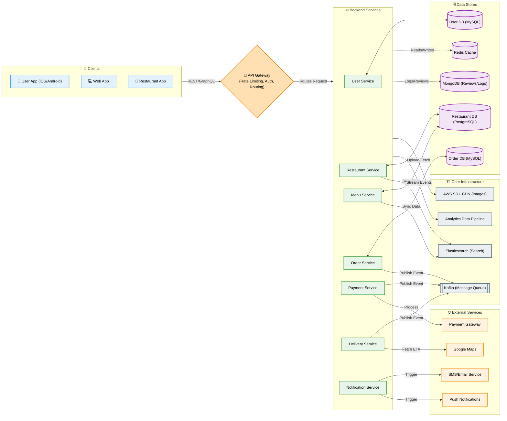
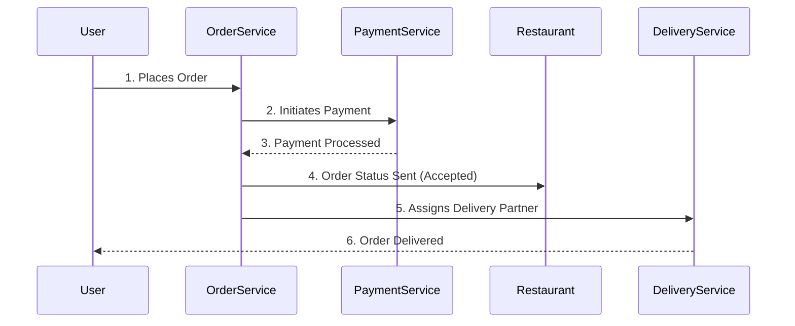

# System Design of Zomato

## 1. Overview
Zomato is a comprehensive food delivery and restaurant discovery platform. It allows users to search for restaurants, view menus, place orders, track deliveries, and make payments. 

The goal is to design a scalable, highly available system to handle millions of users and real-time order deliveries.

---

## 2. Architecture Diagram

*(Note: The diagram above illustrates the high-level flow and interactions between various microservices, data stores, and external components.)*

---

## 3. Components Explanation

### 1. Clients
Users, restaurants, and delivery partners use mobile (Android/iOS) and web apps to interact with the platform.

### 2. API Gateway
The **single entry point** for all incoming requests. It handles:
- Routing
- Rate limiting
- Authentication
- Request aggregation

### 3. Backend Services (Microservices)
- **User Service:** Handles user registration, login, profile management.
- **Restaurant Service:** Manages restaurant onboarding, details, ratings, and availability.
- **Menu Service:** Manages menu items, categories, and prices.
- **Order Service:** Handles order creation, status updates, and cancellations.
- **Payment Service:** Processes payments, refunds, wallets, and promotional offers.
- **Delivery Service:** Assigns delivery partners, tracks live location, and optimizes routes.
- **Notification Service:** Sends SMS, email, and push notifications to users.

### 4. Data Stores
- **Relational DB (MySQL/PostgreSQL):** Used for core transactional data (users, restaurants, orders) to maintain ACID properties.
- **Cache (Redis):** Stores session data, frequently accessed data (like restaurant menus), leaderboards, and active offers.
- **NoSQL DB (MongoDB/Cassandra):** Used for unstructured or high-volume data like reviews, logs, and activity feeds.

### 5. Message Queue
Systems like **Kafka** or **RabbitMQ** decouple services and handle asynchronous tasks such as order status updates, notifications, and payment processing events.

### 6. Search Service
**Elasticsearch** is used for the fast, fuzzy searching of restaurants, cuisines, and specific dishes.

### 7. Image/File Storage
Stores restaurant images, food pictures, and documents in object storage (like AWS S3) and delivers them globally via a **CDN** (Content Delivery Network).

### 8. Analytics Data Pipeline
Collects real-time events (orders, searches, clicks) and processes them for business insights, dashboards, and personalized recommendations.

### 9. External Services
- **Maps (Google Maps):** Used for location mapping, distance calculation, ETA calculation, and route optimization.
- **Payment Gateway:** Third-party integrations (Stripe, Razorpay, etc.) for cards, wallets, and Netbanking.
- **SMS/Email Service:** Third-party services (Twilio, SendGrid) for OTPs, order updates, and marketing offers.
- **Push Notification:** FCM/APNs for real-time notifications to users and delivery partners.

---

## 4. High-Level Order Flow

1. **User places order**
2. **Order Service creates order**
3. **Payment Service processes payment**
4. **Order status sent to Restaurant**
5. **Delivery Partner assigned**
6. **Order delivered to User**

---

## 5. Key Design Considerations

- **Scalability:** Microservices architecture, horizontal scaling, and robust load balancers.
- **High Availability:** Multi-zone deployment, database replication, and automatic failover.
- **Performance:** Extensive caching (Redis), CDN for static assets, database indexing, and async processing (Message Queues).
- **Reliability:** Message queues for guaranteed delivery, retry mechanisms, and frequent database backups.
- **Security:** Standardized authentication (OAuth2), strict authorization, and data encryption (at rest and in transit).
- **Monitoring:** Centralized logging, metric dashboards, and automated alerting.

---

## 6. Key Architectural Challenges

Designing a system like Zomato comes with several highly complex engineering challenges:

### 1. Handling Extreme Traffic Spikes
Food delivery apps experience massive traffic spikes during specific windows (e.g., Friday evenings, lunch hours, or holidays). The system must rapidly auto-scale its backend services and heavily rely on caching (Redis) to prevent the database from buckling under sudden read-heavy loads.

### 2. Real-Time Location Tracking
Delivery partners move constantly, and users expect real-time ETA updates on a map. 
- **Challenge:** Millions of GPS pings hitting the server every second.
- **Solution:** Using highly efficient protocols like **WebSockets** or MQTT for real-time bidirectional communication, and decoupling the ingestion of location data via a fast message queue (Kafka) before processing it.

### 3. Geospatial Searching
When a user opens the app, they need to see restaurants within a specific radius (e.g., 5km) sorted by rating, delivery time, or relevance.
- **Challenge:** Standard mathematical distance queries are far too slow for millions of users.
- **Solution:** Using specialized geospatial indexing like **Elasticsearch** (Geo-point data types), Redis Geo-hashes, or PostgreSQL's PostGIS extension to perform spatial queries in milliseconds.

### 4. Preventing Double Charges (Idempotency)
If a user hits the "Pay" button twice due to network lag, the system cannot charge them twice.
- **Solution:** Implementing strict **Idempotency Keys** at the API Gateway and Payment Service level to deduplicate payment requests.

### 5. Managing Menu and Pricing Complexity
Restaurant menus are highly dynamic (items go out of stock, prices surge, tax rates change based on jurisdiction). 
- **Challenge:** Guaranteeing that the price a user sees on the menu screen is perfectly synchronized with the final checkout price, despite concurrent updates from the restaurant.
- **Solution:** Heavy caching with aggressive cache-invalidation strategies, and relying on distributed transaction patterns (like SAGA) during the final order-placement phase to ensure data consistency.
