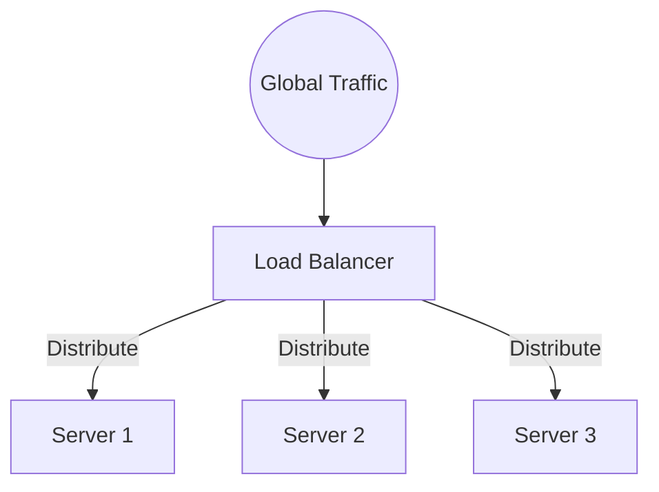
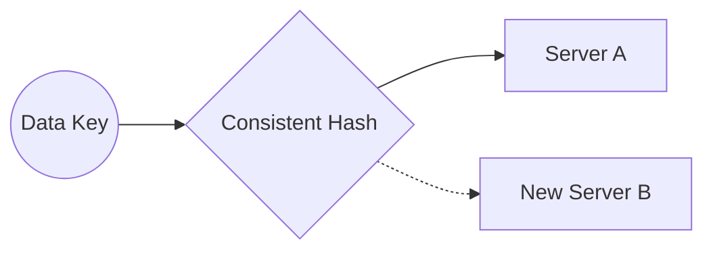

# Traffic & Scaling: Handling the Wave

## Introduction: The "Flash Crowd"

Imagine you launch a new product and suddenly 1 million people visit your site at the exact same second. If you aren't prepared, your server will simply melt under the pressure.

**Scaling** is the art of making sure your system grows as your popularity does.

---

## Part 1: Load Balancing (The "Traffic Cop")

A Load Balancer sits in front of your servers and directs incoming traffic so no single server gets overwhelmed.

*   **Round Robin:** Simply cycles through servers (Server 1, then 2, then 3...).
*   **Sticky Sessions:** Ensures a specific user always goes to the same server (needed if your server stores local data about that user).
*   **Health Checks:** The Traffic Cop is smart. If Server B crashes, the Load Balancer stops sending it traffic automatically.

---

## Part 2: High Availability (ASG & Regions)

You don't want to manually add servers when traffic spikes. 

**Auto-Scaling Groups (ASG):**
A system that watches your CPU usage. If it goes above 70%, it automatically "spins up" more servers. When traffic dies down at night, it deletes them to save you money.

**Single Region Critical Write:**
For some apps, you might have servers all over the world, but all "Writes" (like creating an account) MUST go to one specific region to ensure data integrity. This is a trade-off between speed and correctness.

---

## Part 3: Consistent Hashing (The "Smart Map")

When you add or remove servers from a cluster, you don't want to move all your data. 

**Consistent Hashing** allows you to add a new server while only moving a tiny fraction (1/n) of your data. It maps both servers and data onto a "Circle." When a server is added, it only "takes over" a small slice of the circle from its neighbor.

---

## Part 4: Monitoring (AWS Cloudwatch)

You can't fix what you can't see.
**Cloudwatch** (and similar tools) are the "Dashboard" of your system. They track:
*   **Latency:** How long is the user waiting?
*   **Error Rates:** Is the system crashing?
*   **Throughput:** How many requests per second are we handling?

---

## Revision Summary

| Topic | Key Concept | Why it matters |
| :--- | :--- | :--- |
| **Load Balancer** | Traffic distribution | Prevents overloading; ensures High Availability |
| **ASG** | Elastic scaling | Automatically matches resources to current demand |
| **Hashing** | Mapping keys to servers | Determines where data lives in a cluster |
| **Cloudwatch** | Monitoring & Alerts | Provides visibility into system health and performance |

## Conclusion

Scaling is a continuous journey. By using Load Balancers for distribution, ASGs for elasticity, and Consistent Hashing for efficiency, you can build systems that handles everything from a small blog to a global social network.
