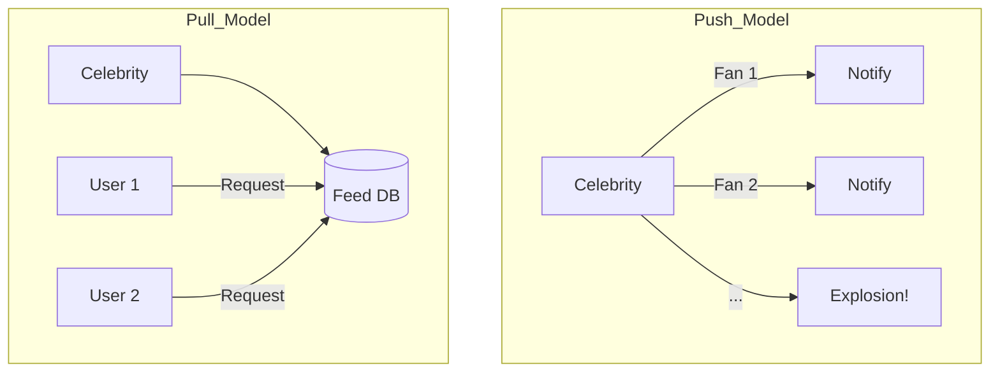

# System Design Patterns: Real World Battles

## Introduction: Where Theory Meets Reality

In textbooks, everything works perfectly. In the real world, systems break in weird and wonderful ways. Here we look at some of the most famous "Headaches" in system design and how top companies solve them.

---

## Part 1: The "Celebrity Problem" (Hotspot)

Imagine a social network where an average user has 200 followers, but a "Celebrity" has 50 million.

*   **The Problem:** When the Celebrity posts a photo, the notification system has to work 250,000 times harder for that one user than for anyone else.
*   **The Solution:** We treat celebrities differently. Instead of "Pushing" their updates to 50 million people, we make the followers "Pull" the update when they open the app.

---

## Part 2: Hotspot Problem & Mutex

A **Hotspot** occurs when a single piece of data (like a viral video or a trending stock) lives on one server, and everyone wants it at once.

*   **Mutex (Mutual Exclusion):** In low-level programming, we use a Mutex to ensure only one "Thread" can touch a piece of data at a time.
*   **Distributed Mutex:** In a large system, we use tools like Redis or Zookeeper to create a "Lock." This prevents two different servers from trying to update the same user's balance at the exact same microsecond.

---

## Part 3: Cross Shard Join

Sharding is great for scale, but it makes queries hard. 
*   **The Pain:** If your Users are on Shard A and their Orders are on Shard B, you cannot perform a simple SQL "JOIN."
*   **The Fix:** 
    1.  **De-normalization:** Store a copy of the User's name inside the Order table.
    2.  **Application Side Join:** The code fetches data from Shard A, then Shard B, and merges them in memory.

---

## Part 4: Case Study - Phone Pe

Phone Pe is one of India's largest payment apps. They handle billions of transactions.

**Key Design Choices:**
1.  **Extreme Reliability:** Payments cannot fail. They use heavy replication and multi-region setups.
2.  **Consistency vs. Availability:** During a bank outage, Phone Pe must decide: Let the user *try* to pay (and maybe fail later) or block them immediately? They often choose high availability with smart retry systems.
3.  **Microservices:** They use hundreds of small, isolated services so that a bug in the "Rewards" section doesn't break the "Payment" section.

---

## Revision Summary

| Topic | Key Concept | Why it matters |
| :--- | :--- | :--- |
| **Celebrity Problem** | Uneven load (Push vs Pull) | Prevents system crashes during viral events |
| **Hotspots** | Extreme traffic on one key | Solved by local caching or better sharding keys |
| **Cross-Shard Join** | Joining data across nodes | De-normalization is often the best real-world fix |
| **Phone Pe Case** | Microservices & Availability | Real-world example of handling payments at scale |

## Conclusion

System design isn't about finding the "Perfect" solution—it's about choosing the right **Trade-offs**. Whether you're handling a Celebrity hotspot or building the next Phone Pe, the best engineers are the ones who understand where their system is most likely to break.
