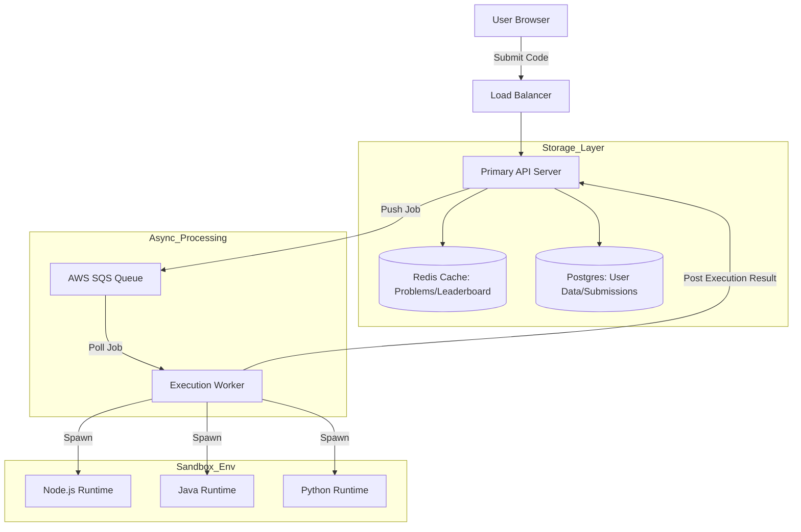

# LeetCode Architecture: The Art of Safe Code Execution

## Introduction: The "Untrusted Code" Challenge

Building a platform like LeetCode isn't just about storing data; it's about running "Untrusted Code" from millions of users simultaneously. If you run a user's `while(true){}` on your main server, the whole system crashes. If a user runs `rm -rf /`, your database vanishes.

LeetCode solves this through a decoupled, asynchronous, and sandboxed architecture.

---

## The Big Picture

Using the components from our design review, here is how the data flows:

---

## Core Components Breakdown

### 1. Primary API Server (The Gatekeeper)
The primary server doesn't execute code. Its job is to:
*   Authenticate the user.
*   Fetch the problem statement from **Postgres** or **Redis**.
*   Save the "Submission" record into the database.
*   Push a "Task ID" into the **AWS SQS** queue.

### 2. AWS SQS (The Buffer)
Code execution is **slow**. A solution might take 10ms or 10 seconds. We cannot let the user wait on an open HTTP connection. 
*   **Decoupling:** SQS allows the API server to stay fast. It just says "I've queued your job," and the user sees a "Pending" status.
*   **Scalability:** If 100,000 users submit code at once, SQS holds the jobs until a worker is free.

### 3. The Worker (The Manager)
Workers are the muscle. They constantly poll SQS for new tasks. Once a worker gets a task, it:
1.  Downloads the user's code.
2.  Sets up the test cases.
3.  Spawns an isolated **Runtime**.

### 4. Isolated Runtimes (The Sandbox)
This is the most critical part. Each language (Java, Python, JS) runs in a strictly limited environment:
*   **Memory Limits:** Prevents memory leaks from crashing the host.
*   **Timeouts:** Kills the process if it goes into an infinite loop (e.g., *Time Limit Exceeded*).
*   **Security:** No network access, no file system access (except for temporary files).

---

## The Workflow: From "Submit" to "Accepted"

1.  **Submission:** User clicks "Submit".
2.  **Queueing:** API Server saves submission to **Postgres** and pushes job to **SQS**. The user gets a `submission_id`.
3.  **Polling:** An available **Worker** picks up the job.
4.  **Execution:** Worker runs the code in a **Sandbox** against hidden test cases.
5.  **Feedback:** Worker sends the "Pass/Fail/Error" result back to the **Primary Server**.
6.  **Update:** Primary Server updates **Postgres** and **Redis** (leaderboard) and notifies the user via WebSockets or long polling.

---

## Summary Table

| Component | Technology | Primary Role |
| :--- | :--- | :--- |
| **API Server** | Node.js / Go / Python | Logic, Auth, Routing |
| **Database** | PostgreSQL | Source of truth (Persistent) |
| **Cache** | Redis | Speeds up Leaderboards & Problem fetching |
| **Queue** | AWS SQS | Handles high-latency tasks asynchronously |
| **Sandboxing** | Docker / gVisor | Isolated code execution for security |

## Conclusion

LeetCode's architecture is a masterclass in **Asynchronous Design**. By separating the "Request" from the "Execution," the system remains responsive even under heavy load. The use of sandboxing ensures that no matter how malicious or buggy a user's code is, the "Primary Server" remains safe and sound.
