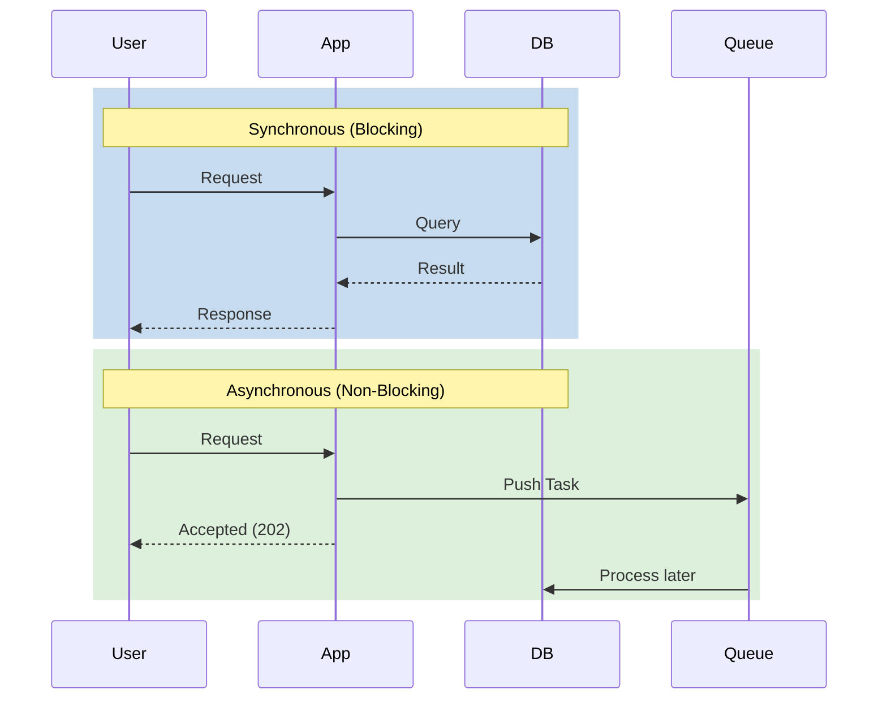

# Async and Sync Communication

In system design, how components communicate is just as important as what they communicate. We generally categorize these interactions into **Synchronous** and **Asynchronous** paradigms.

---

## 1. Synchronous vs. Asynchronous

### Synchronous Communication
Tasks are executed **one by one**, without breaks. The sender waits for a response before moving to the next task.
*   **Analogy:** A phone call. Both parties must be present and engaged at the same time.
*   **Pros:** Simple to reason about, immediate feedback.
*   **Cons:** Can lead to "Cascading Failures" if one service is slow.

### Asynchronous Communication
You have work, and depending on **how available you are**, you can complete it. The sender doesn't wait for a response.
*   **Analogy:** An email. You send it and move on; the recipient reads it when they are free.
*   **Pros:** High decoupling, better resilience, handles traffic spikes well.
*   **Cons:** Complex to manage (needs queues), eventual consistency.

---

## 2. Key Patterns and Concepts

### Throttle
Throttling is used to control the rate of requests. It prevents a single user or service from overwhelming the system.

### Event-Driven Architecture (EDA)
Instead of services calling each other directly, they communicate by publishing and consuming **Events**. This is the ultimate form of decoupling.

### Fan-Out
When a single event (e.g., a "New Post") is sent to multiple subscribers or services simultaneously.

### Dead Letter Queue (DLQ)
A specialized queue for messages that **cannot be processed** (e.g., due to errors). Instead of losing the data, we move it to a DLQ for later inspection and manual retry.

---

## 3. Communication Protocols & Discovery

### HTTP: Why browsers use it?
Browsers use HTTP because it is a stateless, request-response protocol that works perfectly for the request-driven nature of the web. It is standardized, widely supported, and easy to debug.

### DNS (Domain Name System)
DNS is a simple transfer system that maps human-readable names (google.com) to IP addresses.
*   **Rule No 53:** DNS traditionally runs on **Port 53**.
*   **DNS Toys:** A fun way to explore DNS records and tools.

---

## Summary

| Feature | Synchronous | Asynchronous |
| :--- | :--- | :--- |
| **Feedback** | Immediate | Delayed |
| **Coupling** | Tight | Loose |
| **Capacity** | Limited by threads | Limited by queue size |
| **Best For** | User Login, Payments | Notifications, Image Processing |

---

## Conclusion
Choosing between Sync and Async depends on your requirements for latency, consistency, and scale. Most modern systems use a hybrid approach: **Sync** for user-facing actions and **Async** for background processing.
