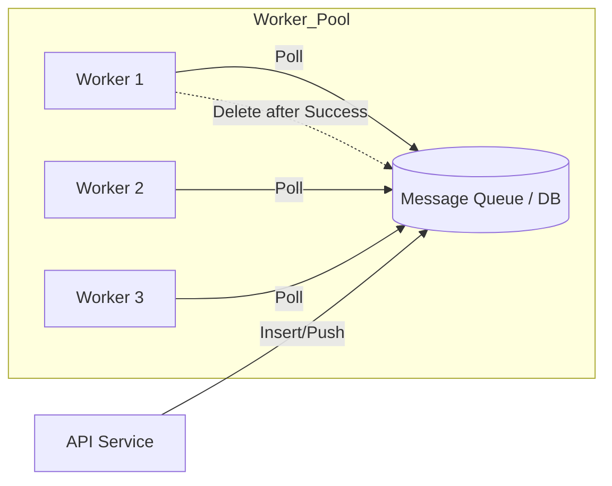
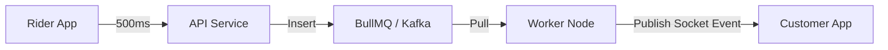

# Pull-Based Architecture: The Power of Independent Workers

## Introduction: The "Take What You Can" Approach

In a **Pull-Based Architecture**, the workers are in control. Instead of a central manager pushing tasks to them, workers proactively ask (poll) a central message broker or database for new work. 

This model is exceptionally robust for handling variable workloads and preventing workers from being overwhelmed.

---

## Data Flow: The Pull Model

In this design, the API server simply drops a "Task" into a queue or database and forgets about it. The workers then "Pull" the task when they are ready.



### The Worker Logic (Pseudo-code)

The worker follows a strict loop to ensure tasks are processed reliably:

```javascript
while (true) {
    if (there_is_task) {
        // 1. Pick it up from the DB/Queue
        // 2. Mark for deletion + set Visibility Timeout (Lease)
        //    (e.g., mark for 10 min)
        perform_task();
        
        // 3. Finally delete the message from the queue
        delete_from_queue();
    }
}
```

### AWS SQS Implementation Detail
For a Simple Queue Service, the logic specifically handles the "Dead Letter" flow:

```pseudo
Read from SQS
Set TTL (Time To Live)
Try:
    performTask()
    if (Success):
        deleteMessageFromQueue()
Exception:
    if (RetryCount > Max):
        pushToDLQ(failed_msg_db)
```

---

## The Starvation Problem

A common mistake in pull-based systems is pushing a failed message back to the same database/queue immediately. 
*   **The Issue:** If a task keeps failing, it stays at the top of the queue, "starving" newer, successful tasks from being processed.
*   **The Fix:** Always offload failed messages to a **Dead Letter Queue (DLQ)** after $X$ retries.

---

## Case Study: Rider Location Tracking & Kafka

Imagine a ride-sharing app where a **Rider** sends their current location every 500ms.



*   **Order Issue:** In a generic pull queue, messages can arrive **not in order** (e.g., location at 1:00 PM arrives after location at 1:01 PM).
*   **The Kafka Advantage:** **Kafka** is a pull-based broker that maintains order within partitions. Workers pull messages sequentially, ensuring the customer sees a smooth path for the rider rather than jumping around.

---

## Summary: Pros and Cons

| Pros | Cons |
| :--- | :--- |
| **No Overwhelming:** Workers only take what they can handle. | **Latency:** Small delay caused by polling intervals. |
| **Automatic Scaling:** Just add more workers; no manager config needed. | **Starvation:** Low-priority tasks might wait forever if the queue is full. |
| **Fault Tolerance:** If a worker dies, the task just times out and returns. | **Complexity:** Handling "In-Flight" logic and DLQs. |
