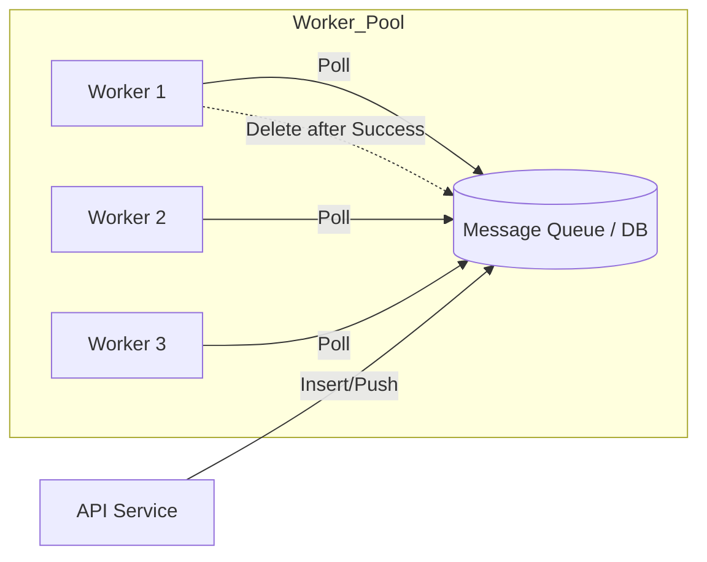

# Pull-Based Architecture: The Power of Independent Workers

## Introduction: The "Take What You Can" Approach

In a **Pull-Based Architecture**, the workers are in control. Instead of a central manager pushing tasks to them, workers proactively ask (poll) a central message broker or database for new work. 

This model is exceptionally robust for handling variable workloads and preventing workers from being overwhelmed.

---

## Data Flow: The Pull Model

In this design, the API server simply drops a "Task" into a queue or database and forgets about it. The workers then "Pull" the task when they are ready.

---

## Core Mechanism: The "Lease" Pattern (Visibility Timeout)

Because multiple workers are pulling from the same source, we need a way to ensure the same task isn't performed twice. This is solved using a **Lease** or **Visibility Timeout**.

1.  **Pick it up:** A worker polls the queue and finds a task.
2.  **Mark for Deletion (In-Flight):** The task is marked as "In Progress." It becomes invisible to other workers for a set `Time Interval` (e.g., 10 minutes).
3.  **Perform:** The worker executes the task.
4.  **Finally Delete:** Upon success, the worker explicitly deletes the message from the queue.

### What if the worker fails?
If the worker crashes mid-task, the `Time Interval` expires. The task becomes visible again, and another worker can pick it up. This ensures **At-Least-Once Delivery**.

---

## Real-World Examples

| System | Role in Pull Architecture |
| :--- | :--- |
| **AWS SQS** | A simple, highly scalable queue system. Uses visibility timeouts. |
| **Kafka** | A distributed streaming platform. Consumers (pullers) maintain their own "offset" (position) in the log. |
| **BullMQ** | A Redis-based queue for Node.js. Optimized for fast job polling. |

---

## Failure Handling: The DLQ Pattern

In the pull model, if a specific task keeps failing (e.g., due to a bug in the code), it would go back to the queue forever. To solve this, we use a **Dead Letter Queue (DLQ)**.

*   **Retry Count:** If a task fails $X$ times, the system stops putting it back in the main queue.
*   **Offloading:** The "poison pill" task is moved to a separate DLQ for manual inspection by developers.

---

## Case Study: Rider Location Tracking
Imagine a ride-sharing app where a Rider sends their location every 500ms. 
*   **The Problem:** If we use a simple queue, messages might arrive **out of order** (e.g., Location at 2s arrives after Location at 4s).
*   **The Pull Solution:** Systems like **Kafka** allow workers to pull messages in the exact order they were sent for a specific "Partition" (specific rider).

---

## Summary: Pros and Cons

| Pros | Cons |
| :--- | :--- |
| **No Overwhelming:** Workers only take what they can handle. | **Latency:** Small delay caused by polling intervals. |
| **Automatic Scaling:** Just add more workers; no manager config needed. | **Starvation:** Low-priority tasks might wait forever if the queue is full. |
| **Fault Tolerance:** If a worker dies, the task just times out and returns. | **Complexity:** Handling "In-Flight" logic and DLQs. |
