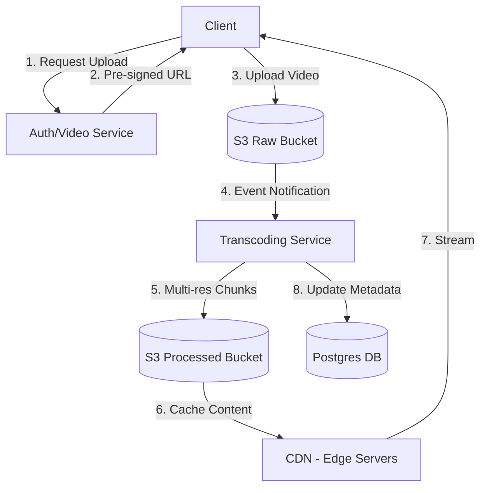
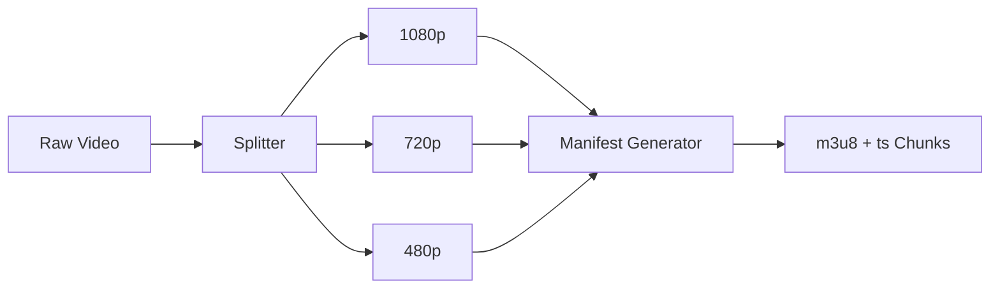

# Case Study: Video Service Architecture (YouTube/Netflix)

Designing a video streaming service is one of the most complex tasks in system design. It requires handling massive data uploads, multi-resolution processing, and low-latency global delivery.

---

## 1. Problem Statement & Requirements

### The "General" Flow
Initially, one might think of a simple setup:
`Client` -> `Video Service` -> `Database (Postgres for metadata)`

### Questions to Ask the Interviewer
Before designing, clarify the scale:
1.  **Data Format:** Are we supporting MP4, AVI, MOV?
2.  **Duration/Size:** What is the average video length and size?
3.  **Daily Uploads:** How many videos are uploaded per day?
4.  **Encoding:** Do we need to support multiple resolutions (1080p, 720p, 480p)?

### Expectations
- **Authentication:** Secure access.
- **High Upload Speed:** Support for large file uploads.
- **Fast Viewing Experience:** Minimal buffering for a global audience.

---

## 2. High-Level Architecture

The key to a scalable video service is **Asynchronous Processing** and **Direct Uploads**.

### Key Mechanisms:
- **Pre-signed URLs:** Allows the client to upload directly to S3, bypassing the application server to save bandwidth and CPU.
- **HLS (HTTP Live Streaming):** A streaming protocol that divides a video into small **Chunks** (.ts files) and an **Index** (.m3u8 file).

---

## 3. Video Transcoding Service

We cannot serve a 4GB raw video directly. We must process it into multiple formats and resolutions.

### The Transcoding Flow

- **FFmpeg:** A powerful command-line tool (not a service itself) used *within* our transcoding service to automate media tasks like transcoding, thumbnail generation, and watermarking.
- **m3u8:** The manifest file that tells the player where to find the chunks for each resolution.

---

## 4. Global Delivery (CDN)

To ensure a **Buffer-Free** experience for users worldwide, we use a **Content Delivery Network (CDN)**.

- **Edge Servers:** Copies of the video content are stored on a distributed network of servers (POP - Points of Presence) located closer to the end-users.
- **Origin:** The CDN is attached to the S3 bucket where processed videos are stored.
- **Caching:** Only the first request for a video chunk hits the S3 bucket; subsequent requests are served from the local Edge server.

---

## Summary of Components

| Component | Role | Why it's used? |
| :--- | :--- | :--- |
| **S3 (Raw)** | Entry storage | Durable storage for original uploads |
| **Transcoding** | Processing | Converts raw video to multi-res HLS chunks |
| **FFmpeg** | Logic | The engine for video manipulation |
| **CDN** | Delivery | Reduces latency by serving from Edge servers |
| **Postgres** | Metadata | Stores video titles, tags, and S3 paths |

---

## Conclusion
A robust video service architecture relies on offloading heavy tasks (uploads to S3, processing to Transcoders) and using standardized streaming protocols (HLS) combined with global distribution (CDN) to provide a premium user experience.
