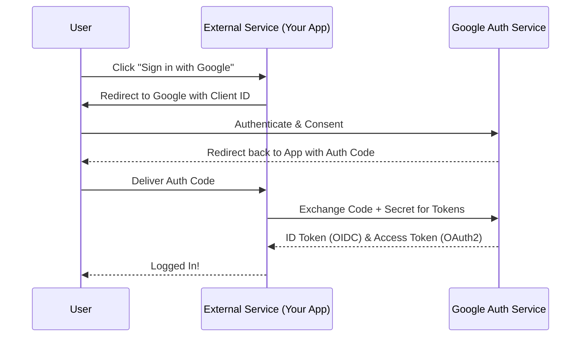

# OIDC and OAuth2 Authentication

Modern systems rarely build their own identity providers from scratch. Instead, they rely on established standards like **OAuth 2.0** and **OpenID Connect (OIDC)** to securely manage user authentication and authorization.

---

## 1. What is OpenID Connect (OIDC)?

**OIDC** is a protocol used to define how systems communicate with an Identity Provider (IdP) like Google or Microsoft. It acts as an identity layer on top of OAuth 2.0.

*   **Standards:** It provides a set of rules and formats for identity tokens.
*   **Data Extraction:** It defines how an external service can securely request and extract user data (like email, name, profile picture).
*   **Alternative:** **SAML** (Security Assertion Markup Language) is an older alternative to OIDC, often used in enterprise environments.

---

## 2. OAuth 2.0 Flow: Establishing Trust

Before two systems can talk, there must be a "Trust Establishment" phase.

### The Developer's Setup
1.  **Fill a Form:** The developer registers their application on the Google Cloud Console.
2.  **Trust:** Google provides a `Client ID` and `Client Secret`. This establishes a bond of trust between the external service and Google.

### The Authentication Flow

---

## 3. Handling Scale and Errors

### HTTP 429: Too Many Requests
If an application or a user hits an API too frequently, the server will return a **429** status code. This is part of **Rate Limiting** or **Throttling**.

### SQS (Simple Queue Service)
In high-traffic authentication or data processing systems, we often use a queue like **AWS SQS** to handle tasks asynchronously.
*   Instead of processing everything immediately, we push "Jobs" to the queue.
*   This ensures that even if there is a spike (e.g., millions of users signing in during a sale), the system doesn't crash.

---

## Summary

| Protocol | Layer | Purpose |
| :--- | :--- | :--- |
| **OAuth 2.0** | Authorization | "Can I access your photos?" |
| **OIDC** | Identity | "Who are you?" |
| **SAML** | Identity | Enterprise alternative to OIDC |

---

## Conclusion
OIDC and OAuth 2.0 are the backbone of modern web security. By delegating identity to trusted providers, developers can focus on building features while ensuring user data remains secure and manageable at scale.
